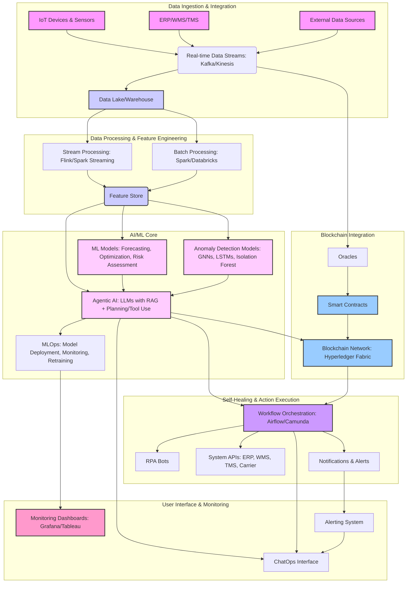

###
Design a comprehensive end-to-end AI-powered supply chain system with anomaly detection, self-healing capabilities,
 and blockchain integration for ultra-resilient real-time logistics.

Cover all Layers,tech,stack,importance indetail
Traditional ML Models and training(realtime,static,ensemble any any other)
Agentic AI with LLM & RAG and Without LLM& RAG
System design architecture diagram
Interview guide & follow up questions
is this is robust tech combination is the right choice.

The design of a comprehensive end-to-end AI-powered supply chain system with anomaly detection, self-healing capabilities, and blockchain integration 
for ultra-resilient real-time logistics is a cutting-edge endeavor. 
This system aims to create a highly efficient, transparent, and robust supply chain capable of anticipating and recovering from disruptions 
with minimal human intervention.

### Importance of this Robust Tech Combination

This combination of technologies is crucial for modern supply chains due to:

* **Unprecedented Volatility:** Global events (pandemics, geopolitical conflicts, natural disasters) highlight the fragility of traditional supply chains.
* **Increased Complexity:** Globalized supply chains involve numerous stakeholders, intricate logistics, and diverse data sources.
* **Demand for Real-Time Visibility:** Businesses need immediate insights into inventory, shipments, and potential disruptions.
* **Need for Proactive Risk Management:** Shifting from reactive problem-solving to predictive and prescriptive actions.
* **Enhanced Trust and Transparency:** Blockchain fosters trust among disparate parties, reducing disputes and fraud.
* **Automation and Efficiency:** AI automates tasks, optimizes processes, and frees human resources for strategic decision-making.

### End-to-End AI-Powered Supply Chain System Design

This system can be conceptualized across several layers:

#### 1. Data Ingestion & Integration Layer

**Purpose:** Collects raw data from various sources across the supply chain in real-time.

**Technologies & Stack:**
* **IoT Devices & Sensors:** RFID tags, GPS trackers, temperature sensors, smart cameras on vehicles, warehouses, and products.
* **Enterprise Systems:** ERP (SAP, Oracle), WMS (Warehouse Management Systems), TMS (Transportation Management Systems), CRM, Procurement systems.
* **External Data Sources:** Weather APIs, traffic data, geopolitical news feeds, market trend data, social media sentiment.
* **Data Streaming Platforms:** Apache Kafka, Amazon Kinesis, Google Cloud Pub/Sub for high-throughput, real-time data ingestion.
* **Data Lake/Warehouse:** Apache Hudi, Delta Lake, Snowflake, Google BigQuery, Amazon Redshift for storing raw and processed data.
* **API Gateways:** Kong, Apigee for secure and efficient API management and integration.

**Importance:** This layer is the foundation. Without comprehensive, real-time, and high-quality data, the AI models will be ineffective. It enables the creation of a "digital twin" of the physical supply chain.

#### 2. Data Processing & Feature Engineering Layer

**Purpose:** Cleans, transforms, and enriches raw data, creating features suitable for AI model training and inference.

**Technologies & Stack:**
* **Stream Processing:** Apache Flink, Spark Streaming for real-time data transformations and aggregations.
* **Batch Processing:** Apache Spark, Databricks for historical data processing and feature generation.
* **Data Transformation Tools:** DBT (Data Build Tool), Airflow for orchestrating data pipelines.
* **Feature Stores:** Feast, Hopsworks for managing and serving features consistently for training and inference.
* **Data Governance & Quality Tools:** Collibra, Alation for ensuring data quality, lineage, and compliance.

**Importance:** High-quality features are critical for accurate AI predictions and anomaly detection. This layer ensures data consistency and prepares it for intelligent analysis.

#### 3. AI/ML Core Layer

**Purpose:** Houses the various AI and Machine Learning models responsible for prediction, optimization, anomaly detection, and self-healing.

**Technologies & Stack:**

**Traditional ML Models and Training:**
* **Demand Forecasting:**
    * **Models:** ARIMA, Prophet (for time series), Gradient Boosting (XGBoost, LightGBM), Neural Networks (LSTMs, Transformers) for capturing complex patterns and external factors.
    * **Training:**
        * **Static/Batch Training:** Periodically retraining models on large historical datasets (e.g., weekly, monthly) to capture long-term trends and seasonality. This uses tools like Apache Spark MLlib, scikit-learn.
        * **Real-time/Online Training:** Continuously updating models with new data (e.g., using techniques like Online Gradient Descent) for faster adaptation to sudden market shifts or disruptions. This requires specialized streaming ML frameworks like Apache Flink ML.
        * **Ensemble Models:** Combining multiple models (e.g., stacking, bagging, boosting) to improve robustness and predictive accuracy, especially for critical predictions.
* **Inventory Optimization:**
    * **Models:** Reinforcement Learning (for dynamic pricing and stocking levels), Optimization algorithms (linear programming for constrained optimization), Regression models.
* **Route Optimization & Logistics:**
    * **Models:** Genetic Algorithms, Ant Colony Optimization, Deep Reinforcement Learning for dynamic route planning, considering real-time traffic, weather, and vehicle capacity.
* **Supplier Risk Assessment:**
    * **Models:** Classification models (Random Forest, SVM, XGBoost) to predict supplier reliability based on historical performance, financial data,
    *  and external news sentiment.
* **Anomaly Detection:**
    * **Models:**
        * **Statistical Methods:** Z-score, IQR, Control Charts for simple deviations.
        * **Machine Learning Models:** Isolation Forest, One-Class SVM, Autoencoders, DBSCAN for detecting multivariate anomalies.
        * **Deep Learning Models:** LSTMs, Transformers for anomaly detection in sequential data (e.g., time series of sensor readings, shipment progress).
        * **Graph Neural Networks (GNNs):** Especially powerful for identifying anomalies in interconnected supply chain networks (e.g., fraudulent transactions, unusual supplier-buyer relationships).
    * **Training:**
        * **Unsupervised Learning:** Often used as anomalies are rare and labeled data is scarce.
        * **Semi-supervised Learning:** Using a small set of labeled anomalies to improve detection.
        * **Online Anomaly Detection:** Real-time monitoring of data streams for immediate anomaly flagging.
* **Predictive Maintenance:**
    * **Models:** Survival analysis, Regression, Classification for predicting equipment failures or maintenance needs based on IoT sensor data.

**Agentic AI with LLM & RAG:**
* **Agentic Orchestration:**
    * **Without LLM & RAG:** Rule-based expert systems and traditional AI planning algorithms (e.g., A\* search, STRIPS) can be used to define automated responses to pre-defined anomalies. For example, if a shipment is delayed by X hours, reroute to alternative carrier Y. This approach is deterministic but less flexible.
    * **With LLM & RAG:** Large Language Models (LLMs) act as the "brain" for intelligent agents.
        * **RAG (Retrieval-Augmented Generation):** LLMs can retrieve relevant information from internal knowledge bases (e.g., past incident reports, supply chain policies, supplier contracts, standard operating procedures) and external data (news, market analysis) to understand the context of an anomaly.
        * **Agentic Capabilities:**
            * **Planning:** LLMs can generate multi-step plans to address complex anomalies (e.g., "Shipper X reported a delay due to weather. I need to identify alternative routes, notify affected customers, find replacement inventory, and update the smart contract.").
            * **Tool Use:** LLMs can interact with external tools and APIs (e.g., calling a TMS API to find alternative routes, sending automated emails, updating ERP systems, initiating smart contract execution).
            * **Reasoning:** LLMs can analyze the root cause of an anomaly, infer potential cascading effects, and propose novel solutions beyond pre-programmed rules.
            * **Human-in-the-Loop:** Provide clear explanations for their decisions and actions, allowing human operators to review and override if necessary.
            * **Continuous Learning:** Learn from human feedback and new data to refine their anomaly detection and self-healing strategies over time.

**Machine Learning Operations (MLOps) Tools:** Kubeflow, MLflow, AWS SageMaker, Azure ML, Google Cloud AI Platform for managing the entire ML lifecycle (experimentation, versioning, deployment, monitoring, retraining).

**Importance:** This is the brain of the system. Accurate AI models provide the intelligence needed for proactive decision-making, while agentic AI allows for autonomous, intelligent responses to disruptions.

#### 4. Blockchain Integration Layer

**Purpose:** Provides an immutable, transparent, and secure ledger for recording critical supply chain events and enabling automated smart contract execution.

**Technologies & Stack:**
* **Blockchain Platforms:** Hyperledger Fabric, Ethereum (private/consortium networks), Corda.
* **Smart Contracts:** Solidity (for Ethereum-based), Chaincode (for Hyperledger Fabric) for defining the logic of automated agreements.
* **Oracles:** Chainlink, Band Protocol for securely bringing off-chain data (e.g., IoT sensor data, shipment status from carriers) onto the blockchain to trigger smart contracts.
* **Decentralized Identifiers (DIDs) & Verifiable Credentials (VCs):** For secure and privacy-preserving identity management of participants.

**Importance:**
* **Trust and Transparency:** All participants have a single, tamper-proof source of truth.
* **Traceability:** End-to-end visibility of product origin, movement, and condition, critical for quality control, recalls, and sustainability.
* **Automated Payments & Agreements:** Smart contracts automatically execute payments or other actions when predefined conditions are met (e.g., delivery confirmation, quality checks).
* **Fraud Prevention:** Immutability prevents data manipulation.
* **Reduced Disputes:** Clear, verifiable records minimize disagreements among partners.

#### 5. Self-Healing & Action Execution Layer

**Purpose:** Translates detected anomalies and AI-driven recommendations into executable actions, often triggered automatically.

**Technologies & Stack:**
* **Workflow Automation/Orchestration:** Apache Airflow, Camunda, AWS Step Functions for defining and executing complex multi-step recovery workflows.
* **Robotic Process Automation (RPA):** UiPath, Automation Anywhere for automating repetitive, rule-based tasks (e.g., data entry into legacy systems, generating reports).
* **Integration Platforms:** MuleSoft, Zapier for connecting various systems and APIs to execute actions.
* **Notification Systems:** PagerDuty, Slack, email for alerting relevant stakeholders.
* **Rule Engines:** Drools, OpenL for defining business rules and conditions for self-healing actions.
* **ChatOps Integration:** Platforms like Slack or Microsoft Teams integrated with AI agents for human-AI collaboration and decision-making during self-healing processes.

**Importance:** This layer closes the loop, moving from detection and prediction to active remediation. It ensures that the system can react quickly and effectively to disruptions, minimizing their impact.

#### 6. User Interface & Monitoring Layer

**Purpose:** Provides a comprehensive dashboard for real-time visibility, anomaly alerts, performance monitoring, and human intervention points.

**Technologies & Stack:**
* **Dashboarding & Visualization Tools:** Grafana, Tableau, Power BI, custom web applications (React, Angular, Vue.js).
* **Alerting & Notification Systems:** Integrations with messaging platforms (Slack, Teams), email, SMS for critical alerts.
* **Log Management & Monitoring:** ELK Stack (Elasticsearch, Logstash, Kibana), Splunk, Datadog for system health and performance monitoring.
* **Interactive Dashboards:** Allowing users to drill down into anomalies, review AI recommendations, and manually trigger or approve actions.

**Importance:** Provides human operators with the necessary visibility and control, allowing them to monitor the system's health, intervene when necessary, and learn from past events.

### System Design Architecture Diagram



### Interview Guide & Follow-up Questions

This section provides a framework for interviewing candidates for roles related to designing, developing, and deploying such a system.

**General Questions (Applicable to all roles):**
1.  Describe your understanding of supply chain resilience and why it's critical today.
2.  What are the biggest challenges in achieving real-time visibility in a global supply chain?
3.  How do you approach balancing efficiency with resilience in supply chain design?
4.  Discuss the ethical considerations and potential biases when implementing AI in critical systems like supply chain.
5.  How do you ensure data privacy and security across a distributed supply chain network?

**Technical Questions (Role-specific):**

**For Data Engineers / Platform Engineers:**
1.  Describe your experience with real-time data ingestion and streaming platforms. What are the trade-offs between Kafka and Kinesis for a supply chain use case?
2.  How would you design a scalable data lake architecture for petabytes of diverse supply chain data?
3.  Discuss strategies for ensuring data quality and lineage in a complex data pipeline.
4.  How would you implement a feature store for real-time and batch ML models in this context?
    * *Follow-up:* What challenges do you foresee in serving features with low latency for real-time anomaly detection?

**For ML Engineers / Data Scientists:**
1.  Which traditional ML models would you consider for demand forecasting in a highly volatile market, and why?
2.  Explain the concept of anomaly detection in time series data. How would you handle false positives and false negatives in a real-time logistics scenario?
3.  How would you leverage Graph Neural Networks (GNNs) for identifying fraudulent activities or bottlenecks in a supply chain network?
    * *Follow-up:* What are the challenges in building and training GNNs for large-scale supply chain graphs?
4.  Discuss the architectural considerations for deploying and monitoring real-time ML models at scale.
5.  What are the key differences between traditional rule-based automation and agentic AI (with/without LLM & RAG) for self-healing, and when would you choose one over the other?

**For AI Architects / Solutions Architects:**
1.  How would you design the interaction between agentic AI (LLMs with RAG) and traditional ML models for optimal decision-making in a self-healing supply chain?
2.  Describe a scenario where an LLM-powered agent would be superior to a traditional rule-based system for resolving a supply chain disruption.
3.  What are the challenges of integrating LLMs into a real-time, high-stakes environment, particularly regarding latency and explainability?
    * *Follow-up:* How would you handle prompt engineering and fine-tuning for LLMs in this domain?
4.  How do you ensure responsible AI practices (fairness, transparency, accountability) are embedded in the system design?
5.  Discuss the scalability challenges of this end-to-end system and how you would address them.

**For Blockchain Developers / Architects:**
1.  Explain the benefits and drawbacks of using Hyperledger Fabric versus a public blockchain like Ethereum (for a private consortium) for supply chain tracking.
2.  How would you design smart contracts to automate payments or quality checks based on real-world events (e.g., goods received, temperature threshold breached)?
3.  What are blockchain oracles, and why are they critical for a system like this?
    * *Follow-up:* What security considerations are there when using oracles?
4.  Discuss strategies for managing data privacy on a blockchain where data is inherently transparent. (e.g., zero-knowledge proofs, off-chain storage).
5.  How would you handle interoperability between different blockchain networks or traditional enterprise systems?

**For DevOps/MLOps Engineers:**
1.  Describe your experience setting up CI/CD pipelines for AI/ML models and distributed systems.
2.  How would you monitor the health and performance of the entire end-to-end system, including data pipelines, ML models, and blockchain nodes?
3.  Discuss strategies for disaster recovery and business continuity for such a critical system.
4.  How would you manage infrastructure as code for this complex architecture?
5.  What are the key security considerations for deploying and operating this system in a cloud environment?

### Is this a Robust Tech Combination?

**Yes, this is an incredibly robust and forward-thinking tech combination for achieving ultra-resilient real-time logistics.** Here's why:

**Strengths:**

1.  **Synergistic Capabilities:**
    * **AI/ML for Intelligence:** Provides predictive power (forecasting), prescriptive actions (optimization), and immediate identification of anomalies.
    * **Agentic AI for Autonomy:** Enables intelligent, goal-oriented decision-making and automated execution, reducing reliance on manual intervention.
    * **Blockchain for Trust & Transparency:** Establishes an immutable, verifiable record of all transactions and events, building trust among disparate parties and ensuring data integrity.
    * **Real-time Data Streaming & Processing:** Ensures the AI models always have the most up-to-date information, crucial for immediate response.
    * **Self-healing Mechanisms:** Automates corrective actions, minimizing disruption duration and impact.

2.  **Enhanced Resilience:**
    * **Proactive Detection:** AI identifies potential issues before they escalate.
    * **Automated Response:** Self-healing capabilities allow for rapid and consistent recovery.
    * **Trust in Data:** Blockchain prevents data manipulation, ensuring reliable information for decision-making even during crises.
    * **Transparency & Accountability:** Blockchain provides a clear audit trail, enabling quick dispute resolution and identifying root causes of disruptions.

3.  **Operational Efficiency:**
    * **Automation:** Reduces manual tasks, freeing up human resources.
    * **Optimization:** Improves resource utilization (routes, inventory, capacity).
    * **Reduced Costs:** Minimizes waste, delays, and potential fraud.

4.  **Improved Decision-Making:**
    * **Data-Driven Insights:** AI provides actionable intelligence from vast datasets.
    * **Contextual Awareness:** LLMs with RAG can synthesize information from diverse sources for more nuanced decision-making.

5.  **Scalability:** Cloud-native architectures and distributed processing frameworks (Kafka, Spark) allow the system to scale with increasing data volume and complexity.

**Challenges & Considerations:**

While robust, this combination also presents significant challenges:

1.  **Data Quality and Integration:** The success heavily relies on clean, consistent, and readily available data from disparate sources. Integrating legacy systems can be a major hurdle.
2.  **Interoperability:** Ensuring seamless communication between various AI models, blockchain networks, and existing enterprise systems.
3.  **Complexity of Development and Maintenance:** Requires a highly skilled workforce across AI, blockchain, data engineering, and DevOps.
4.  **Cost:** Significant upfront investment in infrastructure, talent, and software licenses.
5.  **Explainability and Trust in AI:** Especially with LLMs and complex deep learning models, explaining why a particular action was taken can be challenging, which might hinder human trust and adoption.
6.  **Regulatory and Legal Frameworks:** Blockchain and smart contracts are still evolving legally, and cross-border logistics involve complex regulatory environments.
7.  **Blockchain Adoption:** Widespread adoption across all supply chain partners is necessary to realize its full benefits.
8.  **Security:** Securing all layers, from IoT devices to cloud infrastructure and blockchain nodes, is paramount.

**Conclusion:**

Despite the challenges, the synergy between AI, real-time data, self-healing mechanisms, and blockchain creates a truly transformative and highly resilient supply 
chain system. The benefits in terms of efficiency, risk mitigation, transparency, and adaptability far outweigh the implementation complexities for organizations 
aiming for leadership in the future of logistics. It represents a paradigm shift from reactive supply chain management to a proactive, autonomous, 
and highly trustworthy ecosystem.


Here are 1-2 line answers for the Interview Guide & Follow-up Questions:

### Interview Guide & Follow-up Questions

**General Questions (Applicable to all roles):**
1.  **Describe your understanding of supply chain resilience and why it's critical today?**
    * **Answer:** Supply chain resilience is the ability to adapt to disruptions and return to normal operations quickly, crucial now due to increased global volatility (pandemics, geopolitical shifts).
2.  **What are the biggest challenges in achieving real-time visibility in a global supply chain?**
    * **Answer:** Data silos, lack of standardization, legacy systems, and integration complexities across diverse partners.
3.  **How do you approach balancing efficiency with resilience in supply chain design?**
    * **Answer:** By strategically incorporating redundancies (e.g., diversified suppliers, buffer stock) while optimizing core processes with AI to minimize waste.
4.  **Discuss the ethical considerations and potential biases when implementing AI in critical systems like supply chain.**
    * **Answer:** Ensuring fairness in resource allocation, transparency in AI decisions, and avoiding discriminatory outcomes from biased training data.
5.  **How do you ensure data privacy and security across a distributed supply chain network?**
    * **Answer:** Implementing robust encryption, access controls, tokenization, and potentially leveraging privacy-enhancing technologies like zero-knowledge proofs on blockchain.

**Technical Questions (Role-specific):**

**For Data Engineers / Platform Engineers:**
1.  **Describe your experience with real-time data ingestion and streaming platforms. What are the trade-offs between Kafka and Kinesis for a supply chain use case?**
    * **Answer:** Experience with Kafka for high-throughput, distributed messaging; Kinesis is cloud-native with easier managed services, while Kafka offers more control and flexibility for on-premise/hybrid.
2.  **How would you design a scalable data lake architecture for petabytes of diverse supply chain data?**
    * **Answer:** Using a layered approach (raw, bronze, silver, gold zones) on cloud storage like S3/GCS with technologies like Delta Lake or Apache Hudi for ACID transactions and schema evolution.
3.  **Discuss strategies for ensuring data quality and lineage in a complex data pipeline.**
    * **Answer:** Implementing automated data validation, profiling, monitoring, and using metadata management tools for lineage tracking.
4.  **How would you implement a feature store for real-time and batch ML models in this context?**
    * **Answer:** Utilizing tools like Feast or Hopsworks to serve consistent features, with an online store for low-latency serving and an offline store for batch training.
    * *Follow-up:* **What challenges do you foresee in serving features with low latency for real-time anomaly detection?**
        * **Answer:** Ensuring highly optimized query paths, managing data freshness, and scaling the online feature store to handle high QPS.

**For ML Engineers / Data Scientists:**
1.  **Which traditional ML models would you consider for demand forecasting in a highly volatile market, and why?**
    * **Answer:** Prophet or LSTMs for time series due to their ability to capture seasonality and trends, complemented by XGBoost for incorporating external features like market sentiment.
2.  **Explain the concept of anomaly detection in time series data. How would you handle false positives and false negatives in a real-time logistics scenario?**
    * **Answer:** Detecting deviations from normal patterns; handle false positives through threshold tuning, ensemble methods, and human-in-the-loop validation, and false negatives by adjusting model sensitivity and incorporating domain expertise.
3.  **How would you leverage Graph Neural Networks (GNNs) for identifying fraudulent activities or bottlenecks in a supply chain network?**
    * **Answer:** GNNs can model relationships between entities (suppliers, shipments, locations) to detect unusual connection patterns indicative of fraud or congestion points.
    * *Follow-up:* **What are the challenges in building and training GNNs for large-scale supply chain graphs?**
        * **Answer:** Scalability issues due to graph size, complex feature engineering for nodes and edges, and ensuring data privacy for graph elements.
4.  **Discuss the architectural considerations for deploying and monitoring real-time ML models at scale.**
    * **Answer:** Using containerization (Docker), orchestration (Kubernetes), API gateways for serving, and continuous monitoring for drift and performance with MLOps tools.
5.  **What are the key differences between traditional rule-based automation and agentic AI (with/without LLM & RAG) for self-healing, and when would you choose one over the other?**
    * **Answer:** Rule-based is deterministic and good for simple, predefined actions; Agentic AI (especially with LLM/RAG) offers greater flexibility, reasoning, and adaptive problem-solving for complex, unforeseen disruptions.

**For AI Architects / Solutions Architects:**
1.  **How would you design the interaction between agentic AI (LLMs with RAG) and traditional ML models for optimal decision-making in a self-healing supply chain?**
    * **Answer:** Traditional ML models provide predictions (e.g., delay ETA, demand forecast) which the LLM-powered agent uses as input to form context and plan corrective actions via its reasoning and tool-use capabilities.
2.  **Describe a scenario where an LLM-powered agent would be superior to a traditional rule-based system for resolving a supply chain disruption.**
    * **Answer:** A complex multi-party disruption involving unforeseen geopolitical events, where the LLM can synthesize news, policies, and historical data to generate novel, adaptive recovery plans beyond pre-programmed rules.
3.  **What are the challenges of integrating LLMs into a real-time, high-stakes environment, particularly regarding latency and explainability?**
    * **Answer:** Latency from API calls to LLMs, managing token limits, and ensuring model hallucinations or biases don't lead to incorrect or unexplainable critical decisions.
    * *Follow-up:* **How would you handle prompt engineering and fine-tuning for LLMs in this domain?**
        * **Answer:** Careful crafting of prompts to provide context and constraints, and potentially fine-tuning with domain-specific supply chain data for improved accuracy and relevance.
4.  **How do you ensure responsible AI practices (fairness, transparency, accountability) are embedded in the system design?**
    * **Answer:** Implementing model monitoring for bias, creating explainable AI (XAI) interfaces, establishing clear human oversight points, and comprehensive logging of AI decisions.
5.  **Discuss the scalability challenges of this end-to-end system and how you would address them.**
    * **Answer:** Scaling data ingestion (Kafka clusters), compute for ML inference (Kubernetes autoscaling), and managing blockchain network throughput, addressed by distributed architectures and cloud-native services.

**For Blockchain Developers / Architects:**
1.  **Explain the benefits and drawbacks of using Hyperledger Fabric versus a public blockchain like Ethereum (for a private consortium) for supply chain tracking.**
    * **Answer:** Hyperledger Fabric offers permissioned access and higher transaction throughput, suitable for enterprise consortia, while Ethereum (even private) can be slower with higher transaction costs but might offer greater decentralization.
2.  **How would you design smart contracts to automate payments or quality checks based on real-world events (e.g., goods received, temperature threshold breached)?**
    * **Answer:** Define smart contracts that listen for events via oracles (e.g., IoT sensor data, delivery confirmation) and automatically trigger state changes or payment releases upon meeting predefined conditions.
3.  **What are blockchain oracles, and why are they critical for a system like this?**
    * **Answer:** Oracles are third-party services that provide external, real-world data to smart contracts, critical because blockchains cannot natively access
    * off-chain information to trigger events.
    * *Follow-up:* **What security considerations are there when using oracles?**
        * **Answer:** Ensuring oracle data integrity, preventing single points of failure, and validating the reputation and decentralization of the oracle network.
4.  **Discuss strategies for managing data privacy on a blockchain where data is inherently transparent. (e.g., zero-knowledge proofs, off-chain storage).**
    * **Answer:** Using off-chain storage with cryptographic hashes on-chain, channel-based privacy in Hyperledger Fabric, or leveraging zero-knowledge proofs (ZKPs) to verify data without revealing it.
5.  **How would you handle interoperability between different blockchain networks or traditional enterprise systems?**
    * **Answer:** Through API gateways, blockchain middleware, or cross-chain communication protocols (e.g., atomic swaps, inter-blockchain communication standards).

**For DevOps/MLOps Engineers:**
1.  **Describe your experience setting up CI/CD pipelines for AI/ML models and distributed systems.**
    * **Answer:** Experienced with automating code, data, and model versioning, testing, and deployment (e.g., Git, Jenkins/GitLab CI, Argo CD) for both application and ML components.
2.  **How would you monitor the health and performance of the entire end-to-end system, including data pipelines, ML models, and blockchain nodes?**
    * **Answer:** Implementing comprehensive logging, metrics (Prometheus/Grafana), tracing (Jaeger), and anomaly detection on operational data to identify issues across all components.
3.  **Discuss strategies for disaster recovery and business continuity for such a critical system.**
    * **Answer:** Implementing multi-region deployments, automated backups, RPO/RTO planning, and regular disaster recovery drills.
4.  **How would you manage infrastructure as code for this complex architecture?**
    * **Answer:** Using tools like Terraform or CloudFormation to define and provision all cloud resources consistently and repeatedly.
5.  **What are the key security considerations for deploying and operating this system in a cloud environment?**
    * **Answer:** Implementing least privilege access, network segmentation, robust identity and access management (IAM), data encryption at rest and in transit,
    * and continuous security monitoring.
  
6.  Okay, here's a more detailed tech stack diagram for the end-to-end AI-powered supply chain system, breaking down each layer into topics and specific technology names, including data source, adapters, and connectors.

```mermaid
graph TD
    subgraph Data Sources & Ingestion
        DS1[IoT Devices & Sensors: RFID, GPS, Temp Sensors, Smart Cameras] --> A1(IoT Hub / Gateway Adapters: MQTT, AMQP)
        DS2[ERP/WMS/TMS: SAP, Oracle, JDA, Manhattan] --> A2(Enterprise System Connectors: SAP RFC, REST APIs, JDBC)
        DS3[Carrier/3PL Data: FedEx, UPS, Maersk APIs] --> A3(External API Adapters: REST, SOAP)
        DS4[Market Data: Weather, Traffic, News, Social Media APIs] --> A4(External API Adapters: REST, Web Scraping)
        DS5[Legacy Systems] --> A5(Custom Connectors: ETL, CDC)

        A1 --> B1(Real-time Data Streams: Apache Kafka, Amazon Kinesis, Google Pub/Sub)
        A2 --> B1
        A3 --> B1
        A4 --> B1
        A5 --> B1
    end

    subgraph Data Processing & Feature Engineering
        B1 --> C1(Stream Processing: Apache Flink, Spark Streaming)
        C1 --> D1(Feature Store Online: Redis, DynamoDB)
        C1 --> D2(Data Lake Raw: S3, GCS, Azure Data Lake Storage)

        D2 --> C2(Batch Processing: Apache Spark, Databricks, Snowflake)
        C2 --> D3(Feature Store Offline: Apache Iceberg, Delta Lake, Hudi)
        C2 --> D4(Data Warehouse: Snowflake, Google BigQuery, Amazon Redshift)

        linkStyle 8 stroke-width:2px,stroke:#555;
        linkStyle 9 stroke-width:2px,stroke:#555;
    end

    subgraph AI/ML Core
        D1 & D3 --> E1(ML Training Platform: Kubeflow, AWS SageMaker, Azure ML, Google AI Platform)
        E1 --> E2(Model Registry: MLflow, Seldon Core)

        E2 --> F1(Prediction & Optimization Services: TensorFlow Serving, TorchServe, Triton Inference Server)
        E2 --> F2(Anomaly Detection Services: Custom Python services, Flink ML for streaming anomalies)
        E2 --> F3(Agentic AI Orchestration: LangChain, LlamaIndex, Custom Python Agents)

        F3 --> G1(LLM APIs: OpenAI GPT-4, Google Gemini, Anthropic Claude)
        F3 --> G2(RAG Knowledge Base: Vector DBs - Pinecone, Weaviate, Milvus; Document Stores - Elasticsearch, ChromaDB)

        F1 & F2 & F3 --> H1(MLOps: Model Monitoring, Data Drift, Concept Drift, Explainable AI)
        H1 --> I1(Alerting & Feedback Loop)

        linkStyle 16 stroke-width:2px,stroke:#555;
        linkStyle 17 stroke-width:2px,stroke:#555;
        linkStyle 18 stroke-width:2px,stroke:#555;
        linkStyle 19 stroke-width:2px,stroke:#555;
    end

    subgraph Blockchain Integration
        F3 --> J1(Blockchain API Gateway: Custom REST API, RPC client)
        J1 --> K1(Blockchain Network: Hyperledger Fabric, Ethereum (private/consortium), Corda)
        K1 --> L1(Smart Contracts: Chaincode, Solidity)
        B1 --> L2(Oracles: Chainlink, Band Protocol)
        L2 --> L1
    end

    subgraph Self-Healing & Action Execution
        F3 & I1 & L1 --> M1(Workflow Orchestration: Apache Airflow, Camunda, AWS Step Functions)
        M1 --> N1(RPA Bots: UiPath, Automation Anywhere)
        M1 --> N2(System APIs: ERP, WMS, TMS APIs via ESB/MuleSoft)
        M1 --> N3(Notification & Communication: Twilio, SendGrid, Slack API)
    end

    subgraph User Interface & Monitoring
        H1 & I1 & N3 --> O1(Monitoring & Alerting Dashboards: Grafana, Prometheus, Datadog)
        O1 --> P1(Real-time Supply Chain Digital Twin Visualisation: Custom Web App - React/Angular/Vue.js)
        O1 --> P2(ChatOps Interface: Slack, MS Teams Integration)

        P1 & P2 --> Q1(Human-in-the-Loop Decision Support)
    end

    style DS1 fill:#f9f,stroke:#333,stroke-width:2px
    style DS2 fill:#f9f,stroke:#333,stroke-width:2px
    style DS3 fill:#f9f,stroke:#333,stroke-width:2px
    style DS4 fill:#f9f,stroke:#333,stroke-width:2px
    style DS5 fill:#f9f,stroke:#333,stroke-width:2px
    style A1 fill:#ccf,stroke:#333,stroke-width:2px
    style A2 fill:#ccf,stroke:#333,stroke-width:2px
    style A3 fill:#ccf,stroke:#333,stroke-width:2px
    style A4 fill:#ccf,stroke:#333,stroke-width:2px
    style A5 fill:#ccf,stroke:#333,stroke-width:2px
    style B1 fill:#9cf,stroke:#333,stroke-width:2px
    style C1 fill:#fcf,stroke:#333,stroke-width:2px
    style C2 fill:#fcf,stroke:#333,stroke-width:2px
    style D1 fill:#f9c,stroke:#333,stroke-width:2px
    style D2 fill:#bcf,stroke:#333,stroke-width:2px
    style D3 fill:#f9c,stroke:#333,stroke-width:2px
    style D4 fill:#bcf,stroke:#333,stroke-width:2px
    style E1 fill:#cfc,stroke:#333,stroke-width:2px
    style E2 fill:#cfc,stroke:#333,stroke-width:2px
    style F1 fill:#ffc,stroke:#333,stroke-width:2px
    style F2 fill:#ffc,stroke:#333,stroke-width:2px
    style F3 fill:#ffc,stroke:#333,stroke-width:2px
    style G1 fill:#ffe,stroke:#333,stroke-width:2px
    style G2 fill:#ffe,stroke:#333,stroke-width:2px
    style H1 fill:#cfa,stroke:#333,stroke-width:2px
    style I1 fill:#cfa,stroke:#333,stroke-width:2px
    style J1 fill:#dff,stroke:#333,stroke-width:2px
    style K1 fill:#dff,stroke:#333,stroke-width:2px
    style L1 fill:#dff,stroke:#333,stroke-width:2px
    style L2 fill:#dff,stroke:#333,stroke-width:2px
    style M1 fill:#fdb,stroke:#333,stroke-width:2px
    style N1 fill:#fdb,stroke:#333,stroke-width:2px
    style N2 fill:#fdb,stroke:#333,stroke-width:2px
    style N3 fill:#fdb,stroke:#333,stroke-width:2px
    style O1 fill:#e6b,stroke:#333,stroke-width:2px
    style P1 fill:#e6b,stroke:#333,stroke-width:2px
    style P2 fill:#e6b,stroke:#333,stroke-width:2px
    style Q1 fill:#f8f,stroke:#333,stroke-width:2px
```

Sure, you're looking for specific Kafka topic names within the "Real-time Data Streams" component (B1 in the diagram).

Here's how those Kafka topics could be structured, along with their purpose:

### Real-time Data Streams (Kafka Topics)

Instead of just `Apache Kafka`, `Amazon Kinesis`, `Google Pub/Sub`, this node `B1` would contain a set of defined Kafka topics.

```mermaid
graph TD
    subgraph Real-time Data Streams (Kafka Topics)
        DS1[IoT Devices & Sensors] --> A1(IoT Hub / Gateway Adapters)
        DS2[ERP/WMS/TMS] --> A2(Enterprise System Connectors)
        DS3[Carrier/3PL Data] --> A3(External API Adapters)
        DS4[Market Data] --> A4(External API Adapters)
        DS5[Legacy Systems] --> A5(Custom Connectors)

        A1 --> T1(iot_sensor_readings)
        A2 --> T2(erp_transaction_logs)
        A3 --> T3(shipment_updates)
        A4 --> T4(market_event_data)
        A5 --> T5(legacy_data_streams)

        T1 --> B1_1(raw_sensor_data)
        T2 --> B1_2(raw_erp_events)
        T3 --> B1_3(raw_shipment_events)
        T4 --> B1_4(raw_market_feeds)
        T5 --> B1_5(raw_legacy_streams)

        B1_1 --> C1(Stream Processing)
        B1_2 --> C1
        B1_3 --> C1
        B1_4 --> C1
        B1_5 --> C1
    end

    subgraph Data Processing & Feature Engineering
        C1(Stream Processing: Apache Flink, Spark Streaming) --> D1(Feature Store Online)
        C1 --> D2(Data Lake Raw)
    end

    style A1 fill:#ccf,stroke:#333,stroke-width:2px
    style A2 fill:#ccf,stroke:#333,stroke-width:2px
    style A3 fill:#ccf,stroke:#333,stroke-width:2px
    style A4 fill:#ccf,stroke:#333,stroke-width:2px
    style A5 fill:#ccf,stroke:#333,stroke-width:2px

    style T1 fill:#9cf,stroke:#333,stroke-width:2px
    style T2 fill:#9cf,stroke:#333,stroke-width:2px
    style T3 fill:#9cf,stroke:#333,stroke-width:2px
    style T4 fill:#9cf,stroke:#333,stroke-width:2px
    style T5 fill:#9cf,stroke:#333,stroke-width:2px

    style B1_1 fill:#add8e6,stroke:#333,stroke-width:2px
    style B1_2 fill:#add8e6,stroke:#333,stroke-width:2px
    style B1_3 fill:#add8e6,stroke:#333,stroke-width:2px
    style B1_4 fill:#add8e6,stroke:#333,stroke-width:2px
    style B1_5 fill:#add8e6,stroke:#333,stroke-width:2px

    style C1 fill:#fcf,stroke:#333,stroke-width:2px
    style D1 fill:#f9c,stroke:#333,stroke-width:2px
    style D2 fill:#bcf,stroke:#333,stroke-width:2px
```

**Example Kafka Topic Names and their Purpose:**

1.  **`raw_sensor_data`**:
    * **Purpose:** Ingests raw, unfiltered sensor data from IoT devices (e.g., temperature, humidity, GPS coordinates, vehicle speed, vibration data).
    *  This is the initial landing zone for all IoT stream data.
2.  **`raw_erp_events`**:
    * **Purpose:** Captures real-time event logs and transactional updates from ERP, WMS, and TMS systems (e.g., inventory changes, order placements,
    *  warehouse movements, freight bookings).
3.  **`raw_shipment_events`**:
    * **Purpose:** Receives updates from carrier and 3PL APIs regarding shipment status, delivery confirmations, exceptions, and estimated times of arrival (ETAs).
4.  **`raw_market_feeds`**:
    * **Purpose:** Streams data from external sources like weather APIs, traffic updates, news feeds (for geopolitical events), and social media sentiment.
5.  **`raw_legacy_streams`**:
    * **Purpose:** Dedicated for streams from legacy systems, potentially requiring specific adapters or connectors to normalize data formats before further processing.
6.  **`processed_supply_chain_events`**:
    * **Purpose:** (Produced by Stream Processing - C1) Contains cleaned, standardized, and potentially enriched events after initial stream processing, ready for consumption by AI models and the Data Lake.
7.  **`anomaly_alerts`**:
    * **Purpose:** (Produced by Anomaly Detection Services - F2) A topic specifically for real-time anomaly notifications, consumed by the self-healing layer and monitoring dashboards.
8.  **`action_requests`**:
    * **Purpose:** (Produced by Agentic AI - F3) Contains messages detailing recommended or initiated self-healing actions, consumed by the Workflow Orchestration layer.
9.  **`blockchain_event_logs`**:
    * **Purpose:** (Produced by Blockchain API Gateway - J1) Logs immutable records of critical supply chain events as they are committed to the blockchain, consumed for auditing and enhanced traceability.
  
    * Let's emphasize the "bad weather delaying shipment or orders" scenario, showing how the AI-powered system detects, diagnoses, and self-heals in real-time.

### Scenario: Bad Weather Delays Shipment

**The Problem:** A critical shipment of medical supplies is en route via truck. Unforeseen severe weather (heavy snowstorm) develops, causing road closures and significant delays, putting the delivery at risk and potentially impacting patient care.

---

**System Flow & Emphasis on Time Series Data / Anomaly Detection / Self-Healing:**

#### 1. Data Ingestion & Integration Layer (Real-time Monitoring)

* **Data Sources:**
    * **IoT Devices & Sensors (`raw_sensor_data` Kafka topic):** GPS trackers on the truck continuously send location data, speed, and real-time estimated time of arrival (ETA).
    * **Carrier/3PL Data (`raw_shipment_events` Kafka topic):** The carrier's system updates regarding the shipment's status (e.g., "Departed," "En Route," "Delayed").
    * **External Data Sources (`raw_market_feeds` Kafka topic):** Weather APIs provide real-time precipitation, temperature, and storm alerts for the truck's current and projected route. Traffic APIs provide road closure notifications and congestion data.
* **Emphasis:** The system is constantly consuming and correlating these diverse, high-frequency time series data streams.

#### 2. Data Processing & Feature Engineering Layer (Contextualization)

* **Stream Processing (Apache Flink/Spark Streaming):**
    * **Real-time Feature Generation:** Raw sensor data (e.g., GPS points) is processed to calculate average speed, deviation from planned route, and updated ETA.
    * **Data Fusion:** Weather and traffic data are spatially joined with the truck's current location and route.
    * **Time Series Normalization:** Data streams are aligned and normalized to a consistent time-series format for anomaly detection.
* **Emphasis:** This layer transforms raw, disparate time series into coherent, feature-rich sequences that are suitable for real-time analysis by AI models. For example, it might calculate `(current_ETA - planned_ETA)` as a real-time feature.

#### 3. AI/ML Core Layer (Detection & Intelligence)

* **Anomaly Detection Models (`anomaly_detection_services`):**
    * **Time Series Anomaly Detection:** An LSTM-based model or an Isolation Forest continuously monitors the `updated_ETA` time series for each active shipment.
    * **Pattern Recognition:** It detects unusual patterns:
        * A sudden, significant increase in `updated_ETA` that deviates from normal traffic fluctuations.
        * Truck speed dropping to zero in an unexpected location or for an extended period.
        * Correlation with a *new* weather alert or road closure within the truck's immediate vicinity.
    * **Cross-Modal Anomaly:** The system flags an anomaly when the *combination* of slow speed, increasing ETA, and a sudden severe weather alert for the truck's location occurs simultaneously.
* **Agentic AI (LLMs with RAG - `agentic_ai_orchestration`):**
    * **Anomaly Alert:** The anomaly detection service triggers an alert to the Agentic AI.
    * **RAG Contextualization:** The LLM-powered agent, using RAG, retrieves:
        * **Internal Knowledge Base:** Standard operating procedures for extreme weather delays, list of alternative carriers, contact details for key stakeholders (customer, alternative depots).
        * **Real-time Data:** Latest weather forecasts, traffic maps, current inventory levels at nearest distribution centers, current order priority.
        * **Historical Data:** Past incident reports of weather-related delays and their resolutions.
    * **Reasoning & Planning:** The agent processes this information:
        * **Root Cause Analysis:** "Severe snowstorm has closed I-80, directly impacting Shipment X."
        * **Impact Assessment:** "Estimated 24-hour delay. Medical supplies are critical for patient Y. Nearest alternative depot has limited stock."
        * **Action Planning:** "1. Identify alternative routes. 2. Check alternative carriers. 3. Assess stock at nearby DCs. 4. Notify customer with new ETA and options. 5. Initiate smart contract for delay penalty/insurance claim."
* **Emphasis:** This is where the time series data becomes actionable. The AI goes beyond simply reporting data; it identifies significant deviations, understands their context (weather), assesses impact, and formulates a multi-faceted response plan.

#### 4. Blockchain Integration Layer (Trust & Immutability)

* **Smart Contracts (`smart_contracts`):**
    * **Delay Penalty/Insurance:** A smart contract associated with Shipment X is automatically triggered by the Oracle (L2) receiving the weather-induced delay event (from the `anomaly_alerts` topic).
    * The smart contract checks predefined conditions: "If shipment delayed by > 6 hours due to verified external event (weather API via Oracle), apply penalty A to carrier OR initiate insurance claim B."
    * **Transparency:** All stakeholders (shipper, carrier, insurer, customer) have an immutable record of the delay event, its cause, and the automatically executed contractual obligations.
* **Emphasis:** Blockchain provides the verifiable truth for the delay and automates contractual obligations, building trust and reducing disputes even in unforeseen circumstances.

#### 5. Self-Healing & Action Execution Layer (Automated Recovery)

* **Workflow Orchestration (Apache Airflow):**
    * The Agentic AI's plan is translated into an executable workflow.
    * **Task 1 (Route Rerouting):** Integrates with TMS APIs (`system_apis`) to automatically find and select the optimal alternative route around the closure.
    * **Task 2 (Alternative Sourcing):** Queries WMS APIs (`system_apis`) for inventory levels at nearby distribution centers to identify if urgent partial fulfillment can be done locally.
    * **Task 3 (Customer Notification):** Triggers `notification_communication` APIs to send an automated, personalized alert to the customer with the revised ETA, reason for delay, and potential options (e.g., partial shipment from local stock). The LLM can even generate the notification message.
    * **Task 4 (Carrier Re-engagement):** If needed, the system can automatically initiate contact with an alternative carrier via their API or even an RPA bot (`rpa_bots`) for urgent re-booking.
    * **Task 5 (Smart Contract Execution):** Confirms the delay event, triggering the smart contract execution for the penalty or insurance claim.
* **Emphasis:** This layer brings the AI's intelligence to life, executing a rapid, multi-pronged recovery strategy with minimal human intervention, effectively "healing" the supply chain disruption caused by the weather.

#### 6. User Interface & Monitoring Layer (Human Oversight & Insights)

* **Monitoring Dashboards (Grafana/Tableau):**
    * Real-time "Digital Twin" visualization of the shipment's status, showing the new route, revised ETA, and weather overlay.
    * Alerts for the weather delay and self-healing actions taken are prominently displayed.
* **ChatOps Interface:**
    * The Agentic AI provides a summary of the situation and its proposed/executed actions in a collaborative chat channel (e.g., Slack).
    * Human operators can review the actions, override them if necessary, or provide additional context.
* **Emphasis:** Provides complete transparency to human operators, allowing them to monitor the automated recovery, ensure correctness, and intervene for high-stakes decisions, learning from every event to continuously improve the system.

This detailed scenario highlights how the robust combination of real-time data, time-series anomaly detection, intelligent agentic AI, 
immutable blockchain records, and automated self-healing capabilities creates an ultra-resilient logistics system capable of proactively 
managing complex disruptions like weather-induced delays.
  
    * 
  
    * 
