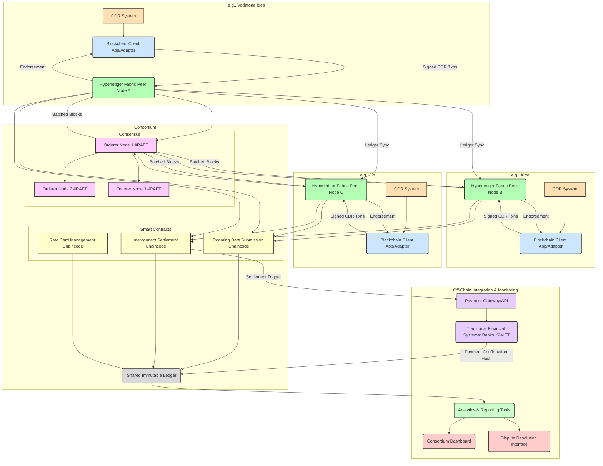
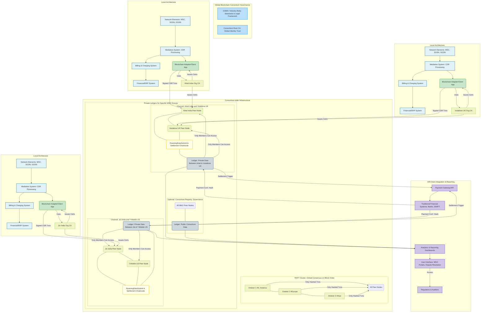

Block chain 1 usecase -hld ,lld,system design,usecases,all layers,e2e

Great — let’s break down the **Blockchain-based Inter-Carrier Roaming & Interconnect Settlement System** across all critical dimensions: use case, HLD, LLD, system components, and all technology layers.

---

## 🧠 Use Case Overview

**Problem**: Telecom carriers need to reconcile roaming and interconnect usage data for billing and settlement. This is often manual, error-prone, delayed, and requires trust across carriers.

**Solution**: A permissioned blockchain network where each telecom operator is a node, ensuring immutable logging of usage records, smart contracts for automated settlement, and real-time dispute resolution.

---
Here’s a **clear breakdown of Blockchain as a Distributed Ledger (DLT)** in the context of **Shared and Private Channels**, tailored for telecom operators like Vodafone, Airtel, Jio, and BSNL, with real-world **use cases**, **examples**, and **illustrations** (conceptually described).

---

## 📘 What is Blockchain as a Distributed Ledger?

**Blockchain (DLT)** is a decentralized, tamper-proof database shared across multiple nodes (participants). Every transaction is verified, agreed upon (consensus), and added as a block to the chain, ensuring **transparency**, **security**, and **immutability**.

### 🔑 Key Traits

* **Immutable**: Once recorded, data cannot be changed.
* **Distributed**: No central authority; each telecom has its own copy.
* **Consensus-Driven**: All parties must agree before data is committed.
* **Programmable**: Smart contracts automate business logic (e.g., billing, settlement).

---

## 🔀 Shared vs Private Channel (Hyperledger Fabric-style)

### 📡 Shared (Global) Channel

* **Participants**: All telecom operators (Vodafone, Airtel, Jio, BSNL)
* **Use**: Regulatory audits, global roaming logs, public settlement status
* **Data Access**: All operators can read/write as allowed

**Example Use Cases**:

* TRAI/Regulator wants a tamper-proof audit trail of interconnect usage
* All carriers need access to high-level roaming metrics

> 📘 **Think of it like a town square ledger where everyone sees every transaction.**

---

### 🔐 Private (Point-to-Point) Channels

* **Participants**: Only specific telecom pairs (e.g., Vodafone ↔ Airtel)
* **Use**: Confidential roaming agreements, interconnect billing
* **Data Access**: Only members of that channel can read/write

**Example Use Cases**:

* Vodafone and Airtel exchange subscriber roaming records for billing
* Jio and BSNL settle data volume consumed between their networks

> 📘 **Think of it like a private ledger room with access control.**

---

## 🖼️ Conceptual Illustration

### 🌍 Global Channel (Public Shared Ledger)

```
 ┌───────────────────────────────────────────────────────┐
 │                     channel-global                    │
 │ ┌─────────┐  ┌────────┐  ┌───────┐  ┌────────┐         │
 │ │Vodafone│  │ Airtel │  │  Jio  │  │  BSNL  │         │
 │ └─────────┘  └────────┘  └───────┘  └────────┘         │
 │  - Common CDR Logs                                      │
 │  - Regulatory Access                                    │
 │  - Public Settlement Status                             │
 └───────────────────────────────────────────────────────┘
```

### 🔒 Private Channels (Peer-to-Peer)

```
 ┌─────────────── channel-voda-airtel ────────────────┐
 │ Vodafone Node       ↔        Airtel Node           │
 │ - Private roaming logs                             │
 │ - Confidential rates                               │
 └────────────────────────────────────────────────────┘

 ┌─────────────── channel-jio-bsnl ───────────────────┐
 │ Jio Node           ↔         BSNL Node             │
 │ - Custom billing rules                             │
 │ - Transactional volume not shared globally         │
 └────────────────────────────────────────────────────┘
```

---

## 🔍 Use Case Summary Table

| Use Case                           | Type    | Channel               | Participants              | Reason                               |
| ---------------------------------- | ------- | --------------------- | ------------------------- | ------------------------------------ |
| TRAI audit trail                   | Shared  | `channel-global`      | All Operators             | Transparency, compliance             |
| Roaming billing: Vodafone ↔ Airtel | Private | `channel-voda-airtel` | Vodafone, Airtel          | Confidential settlement              |
| Interconnect: Jio ↔ BSNL           | Private | `channel-jio-bsnl`    | Jio, BSNL                 | Independent pricing, fast settlement |
| Global Roaming Analytics Dashboard | Shared  | `channel-global`      | All Operators             | Unified stats, reports               |
| Dispute resolution by regulator    | Shared  | `channel-global`      | All Operators + Regulator | Verify evidence                      |

---

## 📋 Benefits of This Structure

| Feature                 | Shared Channel       | Private Channel        |
| ----------------------- | -------------------- | ---------------------- |
| Transparency            | High                 | Restricted             |
| Confidentiality         | Low                  | High                   |
| Regulator Visibility    | Full                 | Limited                |
| Throughput Optimization | Lower (more parties) | Higher (fewer parties) |
| Trust Requirements      | Implicit in rules    | Strong between few     |

---

## 🧠 Summary Analogy

* **Shared Channel** = *"Common ledger for entire city"*
* **Private Channel** = *"Private accounting book between two parties"*

Both are essential in telecom:

* Shared ensures **trust and auditability**
* Private ensures **confidentiality and efficiency**

---

Would you like me to generate:

* Regulatory access flow diagrams?
* Telecom onboarding process to blockchain?
* Data schema comparison for on-chain vs off-chain?

Let me know how deep you'd like to go next.


## ✅ Key Functional Requirements

* Record Call Detail Records (CDRs) and Data Usage
* Reconciliation of interconnect charges
* Real-time validation and consensus of events
* Smart contracts for automatic billing and settlement
* Transparency and auditability
* Dispute resolution and notifications

---

## 🔐 Non-Functional Requirements

* Scalability: Handle millions of CDRs per day
* Performance: Real-time or near-real-time processing
* Security: Data privacy, signature validation, permissioned access
* Interoperability: Integrate with existing BSS/OSS and ERP systems

---

## ⚙️ System Design Overview (HLD)

### 👁️‍🗨️ Architecture Style

* **Permissioned Consortium Blockchain** (Hyperledger Fabric or Quorum)
* **Event-driven architecture** (Kafka/Redis)
* **Microservices** for smart contract interaction and off-chain components

### 🧱 High-Level Components

```
+-------------------------+
|     Carrier A Node      |
|-------------------------|
|  - API Gateway          |
|  - Off-chain Adapter    |
|  - Smart Contract Agent |
|  - Blockchain Peer      |
+-------------------------+
         ↕
      Blockchain
    (Distributed Ledger)
         ↕
+-------------------------+
|     Carrier B Node      |
| (Similar Architecture)  |
+-------------------------+

Off-chain services:
- UI for monitoring, dashboarding
- Analytics pipelines
- Notification and alerting engine
```

---

## 🧩 Key Layers Breakdown

### 1. **Data Ingestion Layer**

* CDRs/Data Usage collected via Kafka/File API from BSS
* Sanitization, validation

### 2. **Blockchain Layer**

* Hyperledger Fabric Network with:

  * **Orderer Nodes**: Transaction ordering
  * **Peer Nodes**: Chaincode execution, endorsement
  * **Channels**: Partitioned data access across carriers
  * **Chaincode (Smart Contracts)**: Written in Go/JavaScript

### 3. **Settlement Logic Layer**

* Smart Contracts:

  * Validate usage events
  * Compute rates and charges
  * Trigger payment instructions

### 4. **Off-chain Integration Layer**

* Integrate with ERP (SAP), Payment Gateways (SWIFT/UPI), Billing Systems
* Store hashed references in blockchain for large data

### 5. **Presentation Layer**

* Web portal for dashboards, reconciliation status
* Audit trail, reports
* Dispute resolution UI

---

## 🔍 LLD - Component-Level View

### 🧠 Smart Contract Logic (Go/Python/JS)

```js
function settleCDR(cdr) {
  validate(cdr);
  let charge = computeCharge(cdr);
  ledger.put(cdr.id, { ...cdr, charge });
  return charge;
}
```

### 📡 Kafka Consumer - CDR Listener

```java
while (true) {
   CDRRecord record = kafkaConsumer.poll();
   if (isValid(record)) {
       blockchainClient.submitTransaction("settleCDR", record);
   }
}
```

### 🧾 Off-chain Adapter

* Syncs heavy data to IPFS/Object Store
* Only stores hash + metadata in chain

### 🔄 Payment Engine

* Listens to “settlement\_due” events
* Calls external payment API (SWIFT/UPI/SAP)

---

## 🧪 End-to-End Flow

1. **CDR Captured** → Kafka → Off-chain Processor
2. **Smart Contract Invoked** → Validates + Logs → DLT
3. **Event Emitted** → Settlement Trigger → Off-chain Payment
4. **Status Updated** → Dashboard / Reports

---

## 🗃️ Storage Plan

* **On-chain**:

  * Transaction ID
  * Hashed CDR
  * Settlement amount, timestamp
* **Off-chain**:

  * Full CDR details in distributed file system (IPFS/S3)

---

## 🛠️ Tech Stack

| Layer           | Tools                         |
| --------------- | ----------------------------- |
| Blockchain      | Hyperledger Fabric / Quorum   |
| Smart Contracts | Go / JS Chaincode             |
| Messaging       | Kafka / RabbitMQ              |
| Integration     | REST, gRPC, SAP connectors    |
| Storage         | IPFS / S3 / PostgreSQL        |
| Monitoring      | Prometheus, Grafana           |
| CI/CD           | Jenkins, GitHub Actions, Helm |

---

## 🧠 Advanced Considerations

* **Channel management** for private settlements between pairs of carriers
* **Zero Knowledge Proofs** for privacy-preserving transactions
* **Tokenization**: Digital tokens for prepaid credits and balance settlement
* **AI-based anomaly detection** in usage patterns

---

## 📊 Benefits

* Near real-time reconciliation
* Reduced disputes and errors
* Faster settlement cycles
* Auditable and tamper-proof records
* Trust and transparency across carriers

---

Would you like me to:

1. Generate architecture diagrams (UML/sequence)?
2. Simulate smart contract samples?
3. Extend for multi-country regulatory compliance?


Here's a **deep dive** into the blockchain-based Inter-Carrier Roaming & Interconnect Settlement system, tailored for **Vodafone, Airtel, Jio, BSNL**, featuring **private channels**, **smart contract simulation**, and **multi-country regulatory compliance**.

---

## 🧩 1. Operator-Specific Setup with Private Channels

### 🔄 Private Channels in Hyperledger Fabric

| Channel Name          | Participants       | Purpose                              |
| --------------------- | ------------------ | ------------------------------------ |
| `channel-global`      | All Operators      | Shared ledger for regulatory/audit   |
| `channel-voda-airtel` | Vodafone, Airtel   | Private roaming/interconnect billing |
| `channel-jio-bsnl`    | Jio, BSNL          | Interconnect settlements             |
| `channel-voda-bsnl`   | Vodafone, BSNL     | Roaming settlements                  |
| ...                   | Pairwise as needed | Independent data confidentiality     |

### 📦 Components in Each Operator Node

```
+---------------------- Vodafone Node -----------------------+
| - API Gateway                                            |
| - Chaincode Agent (Golang)                               |
| - Blockchain Peer (Fabric)                               |
| - CDR Kafka Consumer                                     |
| - ERP Connector (SAP/Oracle)                             |
+----------------------------------------------------------+
```

Replicated for **Airtel**, **Jio**, and **BSNL** with appropriate peers, anchors, and smart contract definitions.

---

## ⚖️ 2. Smart Contract Simulation (Chaincode Sample)

### 🔍 Chaincode Sample in Go (Hyperledger Fabric)

```go
func (s *SmartContract) SettleUsage(ctx contractapi.TransactionContextInterface, cdrID string, usageBytes []byte) error {
    var usage UsageData
    err := json.Unmarshal(usageBytes, &usage)
    if err != nil {
        return fmt.Errorf("invalid usage format: %v", err)
    }

    // Validate CDR
    if usage.Source == "" || usage.Destination == "" || usage.Volume <= 0 {
        return fmt.Errorf("invalid usage data")
    }

    // Compute charge
    rate := s.GetRate(usage.Source, usage.Destination, usage.Type)
    charge := rate * float64(usage.Volume)

    settlement := Settlement{
        CDRID:        cdrID,
        Source:       usage.Source,
        Destination:  usage.Destination,
        Volume:       usage.Volume,
        Rate:         rate,
        Charge:       charge,
        Timestamp:    time.Now().Unix(),
        Status:       "Pending",
    }

    settlementJSON, _ := json.Marshal(settlement)
    return ctx.GetStub().PutState(cdrID, settlementJSON)
}
```

> 🔁 **Trigger Off-chain Service**: Smart contract emits an event to trigger real-world payment via UPI, SWIFT, or SAP.

---

## 🌍 3. Multi-Country Regulatory Compliance

### 🛡️ Features to Ensure Compliance Across Jurisdictions

| Area                        | Implementation Detail                                                                 |
| --------------------------- | ------------------------------------------------------------------------------------- |
| **Data Localization**       | Region-specific off-chain storage (e.g., India → S3-Mumbai, EU → S3-Frankfurt)        |
| **GDPR / DPDPA Compliance** | Personally identifiable info is encrypted, with access keys managed via HSM + audit   |
| **Audit Trails**            | Immutable logs on `channel-global` for regulators to verify any inter-operator action |
| **KYC/AML**                 | Operator nodes integrate with local government KYC endpoints via Oracles              |
| **Digital Signature**       | All transactions signed with root CA verified per nation (TRAI India, BEREC EU, etc.) |

### 🌐 Example Country Configs

```yaml
- India:
    regulator: TRAI
    data_retention: 180_days
    kyc_required: true
    digital_signature: eSign/TRAI
- EU:
    regulator: BEREC
    data_retention: 90_days
    gdpr_compliance: true
    digital_signature: eIDAS
```

---

## 🔁 End-to-End Flow Per Use Case (Vodafone ↔ Airtel, India)

1. **CDR Event Published** to Kafka
2. **Vodafone Node** pulls and sends transaction to `channel-voda-airtel`
3. **Chaincode** validates and stores settlement entry
4. **Smart Contract** emits `settlement_event` → Airtel validates
5. **Payment Gateway Triggered** for clearing
6. **Hash & Status sent to `channel-global`** for audit

---

## 🛠 Optional Extensions

* ✅ **ZKP Integration**: Conceal actual usage volumes, only verify computations.
* 🔐 **Multi-org identity service** (based on DID) for secure onboarding of new telecoms.
* 📊 **AI-based Dispute Resolver** for intelligent classification and auto-resolution of disagreements.
* 🧮 **Oracle Service** for real-time FX rate in multi-currency environments.

---

Would you like the following next?

* ✅ Sequence Diagram for transaction lifecycle?
* ✅ Sample CDR input and smart contract output?
* ✅ Helm/Kubernetes deployment of full setup with all operators?

Let me know how deep you'd like to go in any of these areas.
----


Got it. Let's design a comprehensive end-to-end blockchain solution for a specific telecom use case: **Inter-Carrier Roaming & Interconnect Settlement**.

This use case directly leverages blockchain's strengths in trust, transparency, and automation across multiple, potentially competing, organizations.

---

## Blockchain Use Case: Inter-Carrier Roaming & Interconnect Settlement

**Problem Statement:**
Telecom operators face significant challenges in settling international roaming charges and interconnect fees (for calls/SMS between networks). This process is currently manual, slow (weeks to months), error-prone, opaque, and leads to frequent disputes, impacting cash flow and increasing operational costs for all parties.

**High-Level Goal:** Automate, secure, and accelerate inter-carrier settlement using blockchain, enhancing transparency and reducing disputes.

### 1. High-Level Design (HLD)

**Objective:** Create a shared, real-time, immutable ledger for roaming and interconnect data, enabling automated, dispute-free settlement.

**Core Idea:**
Each operator's network will push validated roaming and interconnect traffic data (call detail records - CDRs) to a consortium blockchain. Smart contracts will then automatically calculate and trigger settlements based on pre-agreed rates and SLAs, all verified by the participating nodes.

**Key Components:**
* **Consortium Blockchain Network:** Operated by participating telecom carriers.
* **Data Ingestion Layer:** Securely pushes CDRs from each carrier's billing/network systems.
* **Smart Contracts:** Encode roaming agreements, rate cards, and settlement logic.
* **Off-chain Integration:** Connects to traditional billing and financial systems for fiat payments.
* **Monitoring & Dispute Resolution Interface:** Provides visibility and channels for handling exceptions.

**Advantages:**
* **Speed:** Settlements in near real-time.
* **Transparency:** All parties see the same, verified data.
* **Accuracy:** Reduced manual errors and reconciliation effort.
* **Trust:** Cryptographically secured and immutable records.
* **Cost Reduction:** Lower operational costs due to automation.

### 2. Low-Level Design (LLD)

**Blockchain Platform Choice:** **Hyperledger Fabric** is an ideal choice for this permissioned, high-throughput enterprise use case due to:
* **Permissioned Network:** Participants are known and authenticated.
* **Private Channels:** Allows for bilateral or multilateral data sharing between specific carriers without exposing all data to everyone on the network.
* **Chaincode (Smart Contracts):** Written in Go, Java, or Node.js, providing robust logic.
* **Pluggable Consensus:** Often uses RAFT for ordering, offering good fault tolerance and performance.
* **Scalability:** Designed for enterprise-grade throughput.

**Detailed Data Flow:**

1.  **CDR Generation (Carrier Internal):**
    * Subscriber makes a roaming call/SMS/data session (e.g., Airtel user roams on Vodafone Idea network).
    * Vodafone Idea's network generates a CDR detailing usage (duration, volume, source, destination, timestamp, etc.).

2.  **CDR Pre-processing & Validation (Carrier Internal):**
    * Vodafone Idea's internal systems (e.g., mediation, billing) process the CDRs, deduplicate, normalize, and validate them against their network records.
    * Crucially, these validated CDRs represent "events" ready for the blockchain.

3.  **Data Ingestion to Blockchain (Peer Node/Client App):**
    * A secure **Blockchain Client Application** or **Adapter** (within Vodafone Idea's perimeter) pulls the validated CDR events.
    * It signs these events cryptographically using Vodafone Idea's private key.
    * It then submits these signed CDR events as **transactions** to Vodafone Idea's **Peer Node(s)** on the Hyperledger Fabric network.

4.  **Transaction Endorsement (Peer Nodes):**
    * The relevant **Chaincode (Smart Contract)** for "Roaming Data Submission" is invoked.
    * Vodafone Idea's Peer Node, acting as an endorser, executes the chaincode to validate the transaction:
        * Is the signature valid?
        * Does the data conform to the agreed schema (DLT template for CDRs)?
        * Does Vodafone Idea have permission to submit this type of data?
    * If valid, the peer node endorses the transaction (signs its approval) and sends it back to the client application.
    * For bilateral agreements (e.g., Airtel also needs to endorse), the client might then send it to Airtel's peer for their endorsement. For multilateral, the endorsing policy defines how many need to endorse.

5.  **Transaction Ordering (Ordering Service):**
    * The endorsed transaction (or transactions, if multiple endorsements are needed) is sent to the **Ordering Service** (e.g., a cluster of 3-5 RAFT nodes).
    * The Ordering Service's sole job is to agree on the *order* of transactions and batch them into blocks. It doesn't execute chaincode.

6.  **Block Distribution & Commit (Peer Nodes):**
    * The Ordering Service broadcasts the newly created block (containing multiple ordered, endorsed transactions) to **all participating Peer Nodes** (e.g., Airtel's, Vodafone Idea's, Jio's).
    * Each Peer Node independently validates the block (checks hash chain, re-executes endorsed transactions to ensure consistency).
    * If all checks pass, the block is **committed** to the Peer's local copy of the **Ledger**. The CDR data is now immutable on the blockchain.

7.  **Smart Contract Execution & Settlement Trigger (Chaincode):**
    * A separate **Settlement Chaincode** can be invoked on a scheduled basis (e.g., daily, hourly) or triggered by an event.
    * This Chaincode reads the immutable CDR data from the ledger for a specific period (e.g., last 24 hours of Vodafone Idea's roaming data on Airtel's network).
    * It applies the pre-agreed roaming rates (defined in the chaincode or referenced from an immutable on-chain rate table).
    * It calculates the net settlement amount owed between Airtel and Vodafone Idea.
    * The Chaincode then creates a **settlement transaction** (e.g., "Vodafone Idea owes Airtel $X for roaming services") and proposes it to the network.

8.  **Off-chain Payment Integration (Gateway/API):**
    * Once the settlement transaction is committed to the blockchain, a **Payment Gateway/Adapter** (connected to the blockchain network) detects this on-chain event.
    * It then triggers an **off-chain fiat payment** via existing banking APIs or corporate payment systems (e.g., SWIFT, SEPA, ACH) to settle the actual funds.
    * A hash of the successful fiat payment confirmation can be recorded back on the blockchain for an end-to-end immutable audit trail.

### 3. System Design & Architecture Diagram



### 4. Use Cases (within this solution)

1.  **Automated Roaming Settlement:** Real-time logging of roaming usage data, enabling automated calculation and settlement of charges between visited and home networks via smart contracts.
2.  **Interconnect Billing:** Similar to roaming, automate the billing and settlement for calls/SMS that originate on one network and terminate on another.
3.  **Dispute Resolution:** Immutable transaction logs provide a single source of truth, drastically reducing manual disputes and providing clear evidence if disputes arise.
4.  **Fraud Prevention (Settlement Fraud):** Prevents manipulation of usage data for settlement, as all records are cryptographically secured and verified by multiple parties.
5.  **Dynamic Rate Management:** Smart contracts can manage and update roaming and interconnect rates on-chain, ensuring all parties are operating with the latest agreed-upon pricing.
6.  **Wholesale Capacity Trading:** In the future, smart contracts could enable dynamic, real-time trading of excess network capacity between operators.

### 5. All Layers (as discussed previously, but tailored to this use case)

* **Data Ingestion & Integration Layer:**
    * **Sources:** CDR systems (internal to each carrier).
    * **Adapters/Connectors:** Custom-built secure APIs/clients to extract validated CDRs from Mediation/Billing systems and push to blockchain peer nodes.
    * **Key Tech:** Internal ETL pipelines, Message Queues (for internal buffering), Hyperledger Fabric SDKs.
* **Data Processing & Feature Engineering Layer:**
    * **Blockchain's Role:** The Chaincode (Smart Contracts) acts as the "processing logic" on the blockchain itself, validating and transforming incoming CDR data before committing to the ledger.
    * **Off-chain:** Limited off-chain processing might occur within each carrier before data submission to normalize formats.
    * **Key Tech:** Go/Node.js for Chaincode, CouchDB/LevelDB (Hyperledger Fabric's state database).
* **AI/ML Core Layer (Potential Future Enhancement):**
    * **Anomaly Detection:** AI/ML models could analyze CDR patterns *on-chain* or *off-chain* (after reading from the ledger) to detect unusual traffic spikes, potential fraud patterns, or imbalances suggesting network issues before they impact settlement.
    * **Predictive Analytics:** Forecasting future roaming/interconnect traffic for better resource planning.
    * **Agentic AI:** An agent could be notified of a detected settlement anomaly and automatically pull relevant CDRs from the blockchain, identify discrepancies, and flag them for human review or initiate a smaller, separate reconciliation transaction.
    * **Key Tech:** Python (TensorFlow/PyTorch) for models, MLflow for MLOps, Kafka/Kinesis for internal anomaly alerts.
* **Blockchain Integration Layer:**
    * **Platform:** Hyperledger Fabric.
    * **Smart Contracts (Chaincode):** `RoamingDataSubmission`, `InterconnectSettlement`, `RateCardManagement`.
    * **Consensus:** RAFT for the ordering service.
    * **Identities:** X.509 certificates for participating organizations and their nodes/users, managed by a Certificate Authority (CA) specific to the consortium.
* **Self-Healing & Action Execution Layer:**
    * **Automated Settlement:** The primary "self-healing" action is the automated calculation and triggering of inter-carrier payments via smart contracts.
    * **Automated Alerts:** If a dispute condition is detected by smart contract logic (e.g., a threshold for unmatched CDRs), it can trigger automated alerts to relevant teams.
    * **Key Tech:** Smart Contracts, Payment Gateway APIs, Workflow Orchestration (e.g., Airflow for batch settlement triggers).
* **User Interface & Monitoring Layer:**
    * **Consortium Dashboard:** A web-based portal providing real-time visibility into roaming and interconnect traffic, settlement status, and historical data for all participants.
    * **Audit Trails:** Ability to drill down into specific transactions on the immutable ledger.
    * **Dispute Resolution Interface:** A module to formally log and manage disputes, with blockchain data serving as undeniable evidence.
    * **Key Tech:** React/Angular/Vue.js (Frontend), Node.js/Python (Backend), Grafana/Prometheus (for infrastructure monitoring).

### 6. End-to-End (E2E) Process Walkthrough

1.  **Usage Occurs:** Vodafone Idea subscriber roams on Airtel's network. CDRs are generated.
2.  **CDR Validation (Internal):** Vodafone Idea validates CDRs internally.
3.  **Data Submission:** Vodafone Idea securely submits validated CDRs as blockchain transactions.
4.  **On-Chain Endorsement & Ordering:** Vodafone Idea's and Airtel's peer nodes endorse the transactions, and the Ordering Service batches them.
5.  **Ledger Commit:** The new block, with roaming usage data, is committed to the shared, immutable ledger across all participating carriers' nodes.
6.  **Settlement Trigger:** Daily/hourly, the `InterconnectSettlement` chaincode executes on the latest data on the ledger.
7.  **Calculation & Proposal:** The chaincode calculates net usage and proposed settlement amounts based on agreed rates.
8.  **Settlement Transaction:** A new settlement transaction (e.g., Vodafone Idea owes Airtel $X) is created and committed to the ledger.
9.  **Off-Chain Payment:** An integrated payment gateway detects the on-chain settlement and initiates the fiat currency transfer between Vodafone Idea's and Airtel's banks.
10. **Confirmation:** The payment confirmation hash is recorded back on the blockchain.
11. **Visibility & Audit:** All parties can view the confirmed usage data and settlement records on their dashboards in real-time, greatly reducing reconciliation efforts and potential disputes.

This E2E process transforms a historically slow, error-prone, and contentious process into a streamlined, transparent, and highly automated system, delivering significant value to the telecom industry.

II.What if the transaction is between vodafone and airtel why jio is required for the agreement?

That's a very perceptive question and highlights a common misunderstanding about consortium blockchains, especially when dealing with privacy! You're absolutely right to ask why Jio (or any other non-transacting party) would need to be involved in an agreement between Vodafone Idea and Airtel.

The key lies in the distinction between the **overall consortium network** and **private channels/data sharing** within that network.

Here's the breakdown:

### Why Jio (or other telcos) would be part of the *overall* network:

1.  **Shared Infrastructure & Governance (Consortium):**
    * The blockchain for inter-carrier settlement is a **consortium blockchain**. This means it's a network built and governed by a group of cooperating, but often competing, organizations (e.g., all major telecom providers in a country or region).
    * Even if a specific transaction is bilateral (Vodafone Idea and Airtel), the **infrastructure** that supports it (the ordering service, the underlying peer nodes, the smart contract code, the network's consensus rules) is **collectively owned and operated by the entire consortium**. Jio, as a consortium member, contributes to maintaining and securing this shared infrastructure.

2.  **Network-Wide Consensus & Immutability:**
    * For a block to be added to the shared ledger, the network's consensus mechanism (e.g., RAFT for ordering, or the endorsement policies for chaincode execution) requires agreement from a certain number of nodes/organizations.
    * While Jio might not be a direct party to the *transaction* between Vodafone Idea and Airtel, its node(s) might still be part of the **ordering service** or the **validation process** for the *block* that contains that transaction. Their role is to ensure the integrity and correct ordering of **all** transactions on the ledger, even if they don't see the full details of every private transaction.

3.  **Future Business & Interoperability:**
    * Today, Vodafone Idea might only be settling with Airtel. Tomorrow, they might need to settle with Jio, or BSNL, or a new entrant. Having everyone on the same foundational blockchain network from the start facilitates future interoperability and reduces the overhead of creating new networks for every bilateral agreement.
    * The consortium's long-term goal is often to standardize and streamline industry-wide processes, not just specific bilateral ones.

### How Privacy is Maintained (and why Jio *doesn't* necessarily see the details):

This is where **Hyperledger Fabric's privacy features** become crucial, specifically:

1.  **Channels:**
    * In Hyperledger Fabric, a "channel" is a **private "subnet" of communication** between two or more specific network members.
    * **For the Vodafone Idea-Airtel settlement, they would create a *private channel* specifically for their bilateral roaming and interconnect data.**
    * **Only peer nodes belonging to Vodafone Idea and Airtel would be members of this channel.** Jio's peer nodes would *not* be members of this channel.
    * This means the **ledger data (the actual CDRs and settlement details) on this channel is only visible to Vodafone Idea and Airtel.** Jio's peer nodes would not store this specific channel's ledger.
    * While the **ordering service** (which might include nodes from Jio) would still process the *transaction hashes* for block ordering, it would **not see the actual private transaction payload**. The data itself is opaque to orderers and non-channel members.

2.  **Private Data Collections (PDCs - even more granular privacy):**
    * PDCs allow a *subset* of organizations on a *single channel* to keep data private from other organizations on that same channel.
    * While channels provide strong isolation, PDCs offer even more granular control. For instance, if Vodafone Idea and Airtel were on a broader channel with other partners, but wanted *specific pricing details* to remain private even from some channel members, they could use a PDC.
    * The **hash** of the private data is recorded on the main channel ledger (which all channel members see), providing an immutable proof of the transaction, but the *actual data* is only gossiped peer-to-peer among the authorized parties and stored in their private databases.

### Analogy:

Think of the **overall Hyperledger Fabric network** as a large **convention center**.

* **All telecom companies (Airtel, Vodafone Idea, Jio, etc.) are tenants** in this convention center, sharing common infrastructure like electricity, security, and a central reception (the ordering service).
* When Vodafone Idea and Airtel want to discuss a private business deal (their roaming settlement), they don't shout it across the entire convention center. Instead, they go into a **private meeting room (a Channel)**.
* **Only people invited to that specific meeting room (Vodafone Idea and Airtel's peer nodes) can see or hear the details of their conversation (the transactions).**
* The central reception (ordering service) knows *that a meeting happened* in that room, and *when it happened*, but doesn't know the specifics of *what was discussed* (it only sees the transaction hashes).

So, Jio is necessary for the **overall stability, security, and governance of the blockchain network** that allows Vodafone Idea and Airtel to transact. However, through the use of **channels**, Jio is *not* privy to the confidential details of the bilateral agreements between Vodafone Idea and Airtel. This allows competitors to collaborate on shared infrastructure while maintaining necessary business privacy.

III.Do jio need to provide the consent to the transaction or reconcilation's between airtel and vodafone .

No, **Jio would typically NOT need to provide consent** to the individual transactions or reconciliations between Airtel and Vodafone Idea on a private Hyperledger Fabric channel.

Here's why, based on the mechanisms we discussed:

1.  **Channels for Privacy:**
    * Airtel and Vodafone Idea would establish a **private channel** on the Hyperledger Fabric network specifically for their bilateral roaming and interconnect settlements.
    * **Only organizations that are members of that specific channel** can see the transactions and the ledger data on that channel.
    * Jio, not being a member of *that specific private channel*, would **not have access to the detailed CDRs or settlement figures** between Airtel and Vodafone Idea.

2.  **Endorsement Policies:**
    * Every transaction on Hyperledger Fabric requires endorsement (approval) based on an **endorsement policy** defined for the chaincode (smart contract) that processes the transaction.
    * For the "Roaming Data Submission" and "Interconnect Settlement" chaincodes on the **Airtel-Vodafone Idea private channel**, the endorsement policy would be configured to require endorsements *only from Airtel and Vodafone Idea's peers*.
    * For example, the policy might be `AND('AirtelMSP.peer', 'VodafoneIdeaMSP.peer')`, meaning both Airtel and Vodafone Idea must endorse. Or `OR('AirtelMSP.peer', 'VodafoneIdeaMSP.peer')` if only one is sufficient, depending on the agreed business logic.
    * **Jio's peers would not be part of this endorsement policy** for transactions on this private channel. Their "consent" or approval is simply not required for the *content* of these bilateral transactions.

3.  **Ordering Service Role:**
    * Jio might operate an **ordering node** as part of the overall consortium's ordering service.
    * The ordering service's job is to guarantee the *order* of transactions and batch them into blocks. It **does NOT execute chaincode** or validate the *content* of the transactions.
    * When Vodafone Idea and Airtel submit a transaction to their private channel, the transaction's payload (the actual CDR data) is **opaque** to the ordering service. The ordering service only sees the **hash** of the transaction, ensuring that even if an ordering node is operated by a competitor (like Jio), they cannot see the sensitive business details.

**In summary:**

Jio's involvement, if any, would be at the **network infrastructure level** (e.g., contributing an ordering node to the shared consortium ordering service, or running a peer node that participates in other, broader consortium channels).

But for the specific, private bilateral transactions and reconciliations between Airtel and Vodafone Idea, **Jio would not need to provide explicit consent or agreement to the details** because they would be operating on a private channel, and their nodes would not be part of the endorsement policy for those specific transactions. The design of Hyperledger Fabric with channels and private data collections is specifically engineered to allow such confidential, bilateral interactions within a larger, shared network.

IV.Do transaction data which are present in the ledger can be seen by jio ,txns btw vodafone and airtel?

To reiterate, if Vodafone and Airtel are conducting transactions on a private channel within the Hyperledger Fabric network,
**Jio would not be able to see the transaction data**. The channel mechanism ensures that only authorized participants (Vodafone and Airtel in this case)
have access to the ledger data within that specific channel.The transaction data itself is opaque to nodes outside of that channel.

V.then consensus of jio is not required?

That's an excellent follow-up question, and it highlights a crucial nuance in how permissioned blockchains like Hyperledger Fabric achieve both privacy and network integrity.

The answer is: **Jio's "consensus" is required at one level, but NOT at another.**

Let's clarify the different types of "consensus" involved:

1.  **Consensus on Transaction Endorsement/Validation (NOT required from Jio):**
    * This is the agreement on whether a specific transaction (like Vodafone Idea sending CDR data to Airtel) is **valid and adheres to the smart contract's rules**.
    * For transactions on a **private channel** between Vodafone Idea and Airtel, the smart contract's **endorsement policy** would typically be configured to only require endorsement from **Vodafone Idea's peer(s)** and **Airtel's peer(s)**.
    * Jio's peer nodes are **not members of this private channel**, so they cannot see the transaction details, execute the chaincode for it, or endorse it. Their "consent" or agreement on the validity of *that specific transaction's content* is **not required**.

2.  **Consensus on Block Ordering and Network Integrity (REQUIRED from Jio, if they are part of the Ordering Service):**
    * This is the agreement on the **order in which transactions are batched into blocks** and the **integrity of the overall blockchain itself**.
    * The **Ordering Service** (which could have nodes operated by Jio, Vodafone Idea, Airtel, etc., as part of the consortium) is responsible for this.
    * When Vodafone Idea and Airtel submit their private transaction to their private channel, it is sent to the Ordering Service. However, the Ordering Service **only sees a cryptographically hashed (opaque) version of the transaction's payload**. It doesn't see the actual sensitive data.
    * The Ordering Service's consensus mechanism (e.g., RAFT) ensures that all ordering nodes agree on the sequence of transactions and the creation of valid blocks. Jio's ordering node, if present, participates in this process.
    * Once a block (containing the opaque private transactions) is ordered, it's broadcast to all relevant peers (including Jio's peer, even if it's not on the private channel). Jio's peer will verify the **block's integrity** (e.g., that the hash chain is correct, that the transaction hashes match, etc.), even if it can't decipher the content of some transactions.

**Analogy Revisited:**

* **Private Channel (Vodafone Idea & Airtel's meeting room):** Vodafone Idea and Airtel discuss and agree on their private business terms (transaction content). **Jio isn't in this room; their consent for the deal's content isn't needed.**
* **Ordering Service (Central Convention Center Reception/Mailroom):** After their meeting, Vodafone Idea and Airtel send their sealed, signed, and anonymized agreement (the hashed transaction) to the central mailroom. **Jio might work at the mailroom (as an ordering node).** Their job is to ensure the mail is delivered in the correct sequence, that it's properly sealed, and that the mailroom's system is running reliably. They don't open the envelopes or read the contents. They contribute to the **overall mail delivery service's consensus and integrity**, but not to the content of individual letters.

**Conclusion:**

Jio's consensus is **not required for the specific endorsement and validation of the private transaction content** between Vodafone Idea and Airtel.
However, their participation in the **shared ordering service and the overall network's consensus for block ordering and integrity** is crucial for the reliability 
and trustworthiness of the entire consortium blockchain that enables these private transactions to happen in the first place.

VI.is this network with in the region /country or can connected to other countries on the single network with nodes(Global at scale)

You've hit on a critical aspect of enterprise blockchain design: **scope and scalability across geographical boundaries.**

Yes, a blockchain network for inter-carrier roaming and interconnect settlement can absolutely be designed to operate **globally**, connecting operators and nodes across different countries and regions. In fact, for international roaming, a global reach is not just possible, but *essential* for the solution to deliver its full value.

Here's how and why:

### Why a Global Network is Necessary for Roaming/Interconnect

* **International Nature of Roaming:** Roaming, by definition, occurs when a subscriber uses their mobile service outside their home network's geographical coverage, often in another country. Therefore, the settlement must occur between operators in different countries.
* **Interconnect:** While interconnect can be domestic, it also frequently occurs internationally for cross-border calls and data traffic.
* **Standardization:** A global network allows for the standardization of data formats (CDRs), smart contract logic (e.g., how roaming rates are applied), and settlement processes across a vast number of bilateral and multilateral agreements, greatly reducing complexity.
* **Network Effect:** The more operators (from different countries) join the network, the more valuable it becomes. Each additional participant further streamlines the overall settlement ecosystem.

### How a Global Network with Nodes Across Countries Works

The technical architecture of a distributed ledger technology (DLT) like Hyperledger Fabric is inherently designed to support geographically dispersed nodes.

1.  **Distributed Nodes:**
    * Each participating telecom operator (e.g., Vodafone UK, Airtel India, T-Mobile US, Orange France) would run their own **peer nodes** in their respective data centers, located in their own country or region.
    * These nodes are connected over the internet (securely, usually via VPNs or dedicated lines) to form the distributed network.
    * The **ordering service nodes** (which provide the global ordering of transactions for the consortium) could also be geographically distributed, potentially operated by a neutral third party, a foundation (like GSMA), or a selection of major global operators to ensure decentralization and resilience across different jurisdictions.

2.  **Consortium Governance:**
    * A global consortium (like the GSMA's eBusiness Network mentioned in the search results) would govern the network. This involves establishing rules, standards, and legal frameworks that all participating international operators agree to adhere to. This is crucial for cross-border operations.
    * This governance would define things like:
        * Standardized CDR formats.
        * Common data models for roaming agreements.
        * Dispute resolution mechanisms.
        * Membership criteria for new international operators.
        * Security and compliance standards across different regulatory environments.

3.  **Jurisdictional and Regulatory Considerations:**
    * While the technology supports global reach, the primary challenges become **legal and regulatory**.
    * **Data Residency:** Operators in different countries might have strict data residency laws (e.g., GDPR in Europe). The blockchain design needs to accommodate this, perhaps through private channels that keep data localized, or by ensuring the platform's architecture can store data within specific geographical boundaries if required.
    * **Legal Enforceability:** Smart contracts need to be legally enforceable across different jurisdictions. This requires careful drafting of consortium agreements and potentially the use of "legal wrappers" around smart contracts.
    * **Taxation:** International settlements involve complex tax regulations (VAT, etc.). The smart contracts would need to incorporate these rules, or the off-chain financial systems would handle them based on blockchain-verified data.
    * **AML/KYC:** Anti-Money Laundering and Know Your Customer regulations vary by country. The consortium would need to establish standards for participant onboarding that satisfy these requirements globally.

4.  **Examples in Practice:**
    * The GSMA (Global System for Mobile Communications Association), which represents mobile operators worldwide, has been actively working on and piloting blockchain solutions for wholesale roaming clearing and settlement. Their "GSMA eBusiness Network" is explicitly designed to be an "industrywide blockchain network" for global inter-operator connectivity.
    * Individual operators like Telefonica, Vodafone, Deutsche Telekom, and AT&T have also explored or implemented blockchain for international roaming, indicating the industry's move towards global solutions.

In conclusion, yes, the network for inter-carrier roaming and interconnect settlement would ideally be a **global network** with nodes operated by telecom operators in various countries. While the technical infrastructure is capable of this, the larger hurdles often lie in establishing the robust legal, regulatory, and governance frameworks necessary to facilitate seamless and compliant cross-border operations.

**could you provide complete architecture diagram (global,private channel ) club also existing archtecture add if any required for holistic reference:**

To provide a complete and holistic architecture diagram for a global inter-carrier roaming and interconnect settlement blockchain, integrating existing systems and illustrating private channels, I need to consider:

1.  **Standard Telecom Operator Architecture:** What are the key systems within a typical telecom operator (BSS/OSS) that interact with roaming and interconnect?
2.  **Global Fabric Setup:** How are ordering service nodes distributed globally? How are certificate authorities (CAs) managed?
3.  **Private Channel Specifics:** How do channels isolate ledger data for bilateral agreements?
4.  **Existing System Integration:** How do existing CDR/billing/mediation systems connect?
5.  **Off-Chain Settlement:** How are fiat payments handled?

Here are the search queries I will use to gather this information:
You're looking for a holistic view of the inter-carrier roaming and interconnect settlement blockchain, encompassing global participation, private channels, and integration with existing telecom systems. This is a complex but crucial diagram for understanding such a solution.

Since I cannot directly generate a visual diagram here, I will provide a detailed textual description of the complete architecture. You can use this as a blueprint to draw your own comprehensive diagram.

---

## Complete Architecture: Global Inter-Carrier Roaming & Interconnect Settlement Blockchain

This architecture will depict the interaction between existing telecom operator systems, a global Hyperledger Fabric blockchain network, and off-chain settlement mechanisms, highlighting the use of private channels.

**Use Case:** Automated, real-time, dispute-free inter-carrier roaming and interconnect settlement for global mobile network operators (MNOs).

---

### **Architectural Layers & Components Description:**

**Layer 1: Existing Telecom Operator Core Systems (Pre-Blockchain)**

* **Description:** These are the traditional Business Support Systems (BSS) and Operations Support Systems (OSS) that each MNO currently uses. They are the data sources for the blockchain. Each MNO (e.g., Airtel India, Vodafone UK, T-Mobile US, Jio India) has its own independent set of these systems.
* **Key Components:**
    * **Network Elements (MSC, SGSN, GGSN, Routers, etc.):** Generate raw traffic data.
    * **Mediation Systems:** Collect, normalize, filter, and aggregate raw network data into Call Detail Records (CDRs) or Usage Detail Records (UDRs). This is where the raw usage data is prepared.
    * **Billing & Charging Systems:** Apply tariffs, calculate charges, generate invoices, and manage subscriber accounts. These systems would historically handle bilateral settlement calculations.
    * **Revenue Assurance & Fraud Management:** Systems to monitor for potential revenue leakage or fraudulent activities.
    * **Customer Relationship Management (CRM):** Manages subscriber information and customer interactions.
    * **Financial & ERP Systems:** Handle general ledger, accounts payable/receivable, and treasury functions.

**Layer 2: Data Ingestion & Integration (Edge of MNO Network)**

* **Description:** This layer acts as the secure bridge between an MNO's internal systems and the blockchain network.
* **Key Components (per MNO):**
    * **Blockchain Adapter/Client Application:** A custom application (using Hyperledger Fabric SDKs) responsible for:
        * Pulling validated CDRs/UDRs from Mediation/Billing systems (via APIs, message queues like Kafka, or file transfers).
        * Transforming the data into a standardized blockchain-compatible format (e.g., JSON schema for CDRs).
        * Digitally signing each transaction using the MNO's private key (managed via a secure HSM or key management service).
        * Submitting the signed transactions to the MNO's own Hyperledger Fabric Peer Node(s).
    * **Security & Gateway:** Firewalls, API Gateways, VPNs, and secure network configurations to protect the flow of data to and from the blockchain network.

**Layer 3: Global Hyperledger Fabric Consortium Blockchain Network**

* **Description:** This is the core shared DLT infrastructure, a permissioned network collaboratively operated by all participating global MNOs.
* **Key Components:**
    * **Membership Services Providers (MSPs) / Certificate Authorities (CAs):**
        * **Root CA:** A central, trusted entity (e.g., managed by GSMA or a mutually agreed-upon neutral body) that issues identity certificates for all consortium members (MNOs).
        * **Organizational CAs (per MNO):** Each MNO runs its own CA within its domain, subservient to the Root CA. This issues identities for its peer nodes, client applications, and users. This enables cryptographic identities for all participants.
    * **Peer Nodes (Distributed Globally):**
        * Each participating MNO (Airtel India, Vodafone UK, T-Mobile US, Jio India) runs one or more **Peer Nodes** in their secure data centers.
        * These nodes store the ledger data for the channels they are part of and execute smart contracts (chaincode).
        * **Anchor Peers:** Designated peers within each organization that help other peers discover each other for gossip communication.
    * **Ordering Service Nodes (Globally Distributed for Resilience):**
        * A cluster of independent nodes (e.g., 3-5+ nodes using RAFT consensus) responsible for:
            * Collecting endorsed transactions from various channels.
            * Agreeing on the chronological order of all transactions.
            * Batching transactions into blocks.
            * Broadcasting these blocks to all connected peer nodes.
        * These nodes are typically run by a mix of consortium members or neutral entities to ensure decentralization of the ordering process.
    * **Channels (Crucial for Privacy):**
        * **Main Consortium Channel (Optional/Meta-Channel):** A public channel for network-wide announcements, governance changes, and perhaps a registry of global operator IDs and their public keys. All MNOs are members.
        * **Bilateral Private Channels (e.g., `Airtel_VodafoneUK_Channel`):**
            * **Crucial for direct settlement.** Only the involved MNOs (e.g., Airtel India and Vodafone UK) are members of this channel.
            * All CDRs and specific settlement details between these two MNOs reside *only* on the ledger of this private channel, visible only to their respective peer nodes. Jio's nodes would *not* have access to this ledger data.
            * Smart contracts for their specific roaming agreements and settlement logic are deployed on *this channel*.
        * **Multilateral Regional Channels (e.g., `EU_Roaming_Channel`):**
            * A channel for a group of MNOs within a specific region (e.g., all EU operators) to handle regional agreements or shared services.
            * Only members of this channel see its ledger data.
    * **Smart Contracts (Chaincode):**
        * **`RoamingDataSubmissionChaincode`:** Deployed on bilateral channels. Validates and stores CDRs submitted by operators, ensuring data conforms to agreed standards (e.g., GSMA BCE/TAP).
        * **`InterconnectSettlementChaincode`:** Deployed on bilateral channels. Contains the business logic for calculating settlements based on submitted CDRs and pre-agreed rates, triggering settlement requests.
        * **`RateCardManagementChaincode`:** Deployed on bilateral or multilateral channels. Manages the lifecycle of roaming/interconnect rates, allowing secure, immutable updates to tariffs agreed between parties.
        * **`DisputeResolutionChaincode` (Future/Advanced):** Automates initial dispute checks and flags discrepancies based on predefined thresholds.

**Layer 4: Off-Chain Integration & Reporting**

* **Description:** Connects the blockchain data and smart contract outputs to traditional financial systems and provides analytics/monitoring tools.
* **Key Components:**
    * **Payment Gateway/Adapter:**
        * Monitors settlement transactions committed to blockchain channels.
        * Triggers actual fiat currency payments via existing banking APIs (SWIFT, ACH, SEPA) or MNOs' internal treasury systems.
        * Records a hash of the payment confirmation back onto the blockchain for auditability.
    * **Analytics & Reporting Dashboards:**
        * Pulls data (validated CDRs, settlement records, audit trails) from the blockchain ledger (via Hyperledger Fabric SDKs).
        * Provides real-time visualization of traffic, settlement status, and reconciliation data for all participating MNOs.
        * Allows for historical analysis and performance monitoring.
    * **Dispute Resolution Interface:** A user interface that leverages the blockchain's immutable records to facilitate rapid dispute identification, analysis, and resolution. When a discrepancy is detected (either by a smart contract or manually), all relevant on-chain data is available for transparent review.
    * **Regulatory & Audit Portals:** Provides read-only access to specific, non-confidential ledger data for authorized regulatory bodies or auditors, enhancing compliance.

---

### **Holistic Architecture Diagram Elements (Conceptual):**

```
+---------------------------------------------------------------------------------------+
|                                  GLOBAL BLOCKCHAIN CONSORTIUM GOVERNANCE              |
|                             (e.g., GSMA-led, establishes rules, standards, CAs)       |
+---------------------------------------------------------------------------------------+
|                                           ROOT CA                                     |
|                                       (Consortium-wide)                               |
+---------------------------------------------------------------------------------------+

+---------------------------------------------------------------------------------------------------------------------------------------------+
|                                                          GLOBAL HYPERLEDGER FABRIC NETWORK                                                    |
+---------------------------------------------------------------------------------------------------------------------------------------------+
|  +---------------------------------------------------------------------------------------------------------------------------------------+  |
|  |                                                 ORDERING SERVICE (RAFT Cluster)                                                       |  |
|  |  (Nodes distributed globally for resilience, e.g., N. America, Europe, Asia, Africa)                                                  |  |
|  |  [Orderer 1 (US)] <---> [Orderer 2 (EU)] <---> [Orderer 3 (Asia)] <---> ... (Maintains transaction ordering, opaque to content)      |  |
|  +---------------------------------------------------------------------------------------------------------------------------------------+  |
|                                                                                                                                             |
|  +---------------------------------------------------------------------------------------------------------------------------------------+  |
|  |                                                         CHANNELS (Data Isolation)                                                   |  |
|  |  +--------------------------------------------------------------------------------+  +------------------------------------------------+  |
|  |  |                    PRIVATE CHANNEL: Vodafone UK <--> Airtel India              |  |             PRIVATE CHANNEL: Jio <--> T-Mobile US    |  |
|  |  |  - Members: Vodafone UK MSP, Airtel India MSP                                  |  |  - Members: Jio MSP, T-Mobile US MSP             |  |
|  |  |  - Dedicated Ledger (CDR & Settlement Data ONLY between them)                  |  |  - Dedicated Ledger                             |  |
|  |  |  - Chaincode: RoamingDataSubmit, InterconnectSettlement, RateCardMgmt           |  |  - Chaincode: RoamingDataSubmit, etc.           |  |
|  |  +--------------------------------------------------------------------------------+  +------------------------------------------------+  |
|  |  |                                 Other Bilateral / Multilateral Channels...                                                         |  |
|  |  +---------------------------------------------------------------------------------------------------------------------------------------+  |
+---------------------------------------------------------------------------------------------------------------------------------------------+

                                                                  |
                                                                  | (Secure API Calls, TLS/mTLS)
                                                                  V

+---------------------------------------------------------------------------------------------------------------------------------------------+
|                                                INDIVIDUAL MOBILE NETWORK OPERATOR (MNO) ARCHITECTURES                                       |
+---------------------------------------------------------------------------------------------------------------------------------------------+

    **MNO 1: Airtel India (Example)** **MNO 2: Vodafone UK (Example)** **MNO 3: Jio India (Example)**
+----------------------------------------+                           +----------------------------------------+                     +----------------------------------------+
|                                        |                           |                                        |                     |                                        |
|  **LAYER 1: Existing Core Systems** |                           |  **LAYER 1: Existing Core Systems** |                     |  **LAYER 1: Existing Core Systems** |
|  - Network Elements                    |                           |  - Network Elements                    |                     |  - Network Elements                    |
|  - Mediation System (CDR Processing) -->+                           |  - Mediation System (CDR Processing) -->+                     |  - Mediation System (CDR Processing) -->+
|  - Billing & Charging System           |                           |  - Billing & Charging System           |                     |  - Billing & Charging System           |
|  - Financial/ERP Systems               |                           |  - Financial/ERP Systems               |                     |  - Financial/ERP Systems               |
|  - Revenue Assurance                   |                           |  - Revenue Assurance                   |                     |  - Revenue Assurance                   |
|  - (Internal Databases)                |                           |  - (Internal Databases)                |                     |  - (Internal Databases)                |
+----------------------------------------+                           +----------------------------------------+                     +----------------------------------------+
              |                                                                     |                                                             |
              V (Validated CDRs/UDRs)                                             V (Validated CDRs/UDRs)                                     V (Validated CDRs/UDRs)
+----------------------------------------+                           +----------------------------------------+                     +----------------------------------------+
|  **LAYER 2: Data Ingestion & Integration** |                           |  **LAYER 2: Data Ingestion & Integration** |                     |  **LAYER 2: Data Ingestion & Integration** |
|  - Blockchain Adapter/Client App        |                           |  - Blockchain Adapter/Client App        |                     |  - Blockchain Adapter/Client App        |
|    (Hyperledger Fabric SDKs)           |                           |    (Hyperledger Fabric SDKs)           |                     |    (Hyperledger Fabric SDKs)           |
|  - MNO-specific CA (Org-level)         |                           |  - MNO-specific CA (Org-level)         |                     |  - MNO-specific CA (Org-level)         |
|  - HSM/Key Management Service          |                           |  - HSM/Key Management Service          |                     |  - HSM/Key Management Service          |
+----------------------------------------+                           +----------------------------------------+                     +----------------------------------------+
              | (Signed Txns for Specific Channels)                                 | (Signed Txns for Specific Channels)                                 | (Signed Txns for Specific Channels)
              +--------------------------------------------------------------------------------------------------------------------------------------------------------------------------------------------------------------------------------------------------------------------------------+
                                                                                                                                                                                                                                                                                                 |
                                                                                                                                                                                                                                                                                                 V
                                                                                                                                                                                                                                           (Connects to appropriate Channel Peer Nodes)
                                                                                                                                                                                                                                           (e.g., Airtel's Client App sends to Airtel's Peer for the Airtel-Vodafone UK Channel)

+---------------------------------------------------------------------------------------------------------------------------------------------+
|                                                          LAYER 3: HYPERLEDGER FABRIC PEER NODES (Distributed Globally)                        |
+---------------------------------------------------------------------------------------------------------------------------------------------+
|    [Airtel India Peer Node 1] <---------------------+ [Vodafone UK Peer Node 1] <---------------------+ [Jio India Peer Node 1]          |
|    (Stores Ledger for Airtel-Vodafone UK Channel)   | (Stores Ledger for Airtel-Vodafone UK Channel)   | (Stores Ledger for Jio-T-Mobile US Channel)      |
|    (Executes Chaincode on relevant Channels)        | (Executes Chaincode on relevant Channels)        | (Executes Chaincode on relevant Channels)          |
|    [Airtel India Peer Node 2] <---------------------+ [Vodafone UK Peer Node 2] <---------------------+ [T-Mobile US Peer Node 1]        |
|                                                     |                                                  | (Stores Ledger for Jio-T-Mobile US Channel)        |
+-----------------------------------------------------+--------------------------------------------------+------------------------------------+
              ^                                                     ^                                                     ^
              | (Blocks from Ordering Service)                      | (Blocks from Ordering Service)                      | (Blocks from Ordering Service)
              |                                                     |                                                     |
              +-----------------------------------------------------+-----------------------------------------------------+

+---------------------------------------------------------------------------------------------------------------------------------------------+
|                                                 LAYER 4: OFF-CHAIN INTEGRATION & REPORTING                                                  |
+---------------------------------------------------------------------------------------------------------------------------------------------+
|  +---------------------------------------------------------------------------------------------------------------------------------------+  |
|  |  Payment Gateway/Adapter (Monitors On-chain Settlement Txns) --------> Traditional Financial Systems (Banks, SWIFT, ACH)                |  |
|  |                                                                        ^ (Fiat Payment Initiated)                                        |  |
|  |                                                                        |                                                                 |  |
|  |  Payment Confirmation Hash (Recorded on Blockchain Ledger) <-----------+                                                                 |  |
|  +---------------------------------------------------------------------------------------------------------------------------------------+  |
|                                                                                                                                             |
|  +---------------------------------------------------------------------------------------------------------------------------------------+  |
|  |  Analytics & Reporting Tools (Pull data from Peer Ledgers) --> Consortium/MNO Dashboards (Real-time Settlement, Traffic, Audit)      |  |
|  |  Dispute Resolution Interface (Uses immutable ledger data)                                                                              |  |
|  |  Regulatory/Audit Portals (Read-only access to permissible data)                                                                        |  |
|  +---------------------------------------------------------------------------------------------------------------------------------------+  |
+---------------------------------------------------------------------------------------------------------------------------------------------+
```

### Explanation of Global and Private Channel Aspects:

* **Global Reach:**
    * **Distributed Peers:** Each MNO, regardless of its country, operates its own peer nodes that connect to the common Hyperledger Fabric network. This physically distributes the ledger copies worldwide.
    * **Distributed Ordering Service:** The ordering service nodes are also ideally geographically distributed to enhance resilience and lower latency for all participants.
    * **Global CA Structure:** A hierarchical CA system (Root CA for the consortium, Org CAs for each MNO) ensures trusted identities across all international participants.
    * **Common Standards:** The success of this global network relies on common data models and smart contract standards agreed upon by the GSMA or a similar industry body.

* **Private Channels & Data Isolation:**
    * **Bilateral Channels are Key:** The diagram explicitly shows `PRIVATE CHANNEL: Vodafone UK <--> Airtel India`. This is where their actual roaming and interconnect CDRs and specific settlement amounts are stored.
    * **Exclusive Membership:** Only the peer nodes of Vodafone UK and Airtel India are members of this channel.
    * **Isolated Ledger:** The ledger data for this channel is *only* replicated and stored on the peer nodes of Vodafone UK and Airtel India. Jio's peer nodes (or any other MNO's peer nodes) do **not** receive or store the ledger data for this private channel.
    * **Smart Contract Scoping:** The `RoamingDataSubmissionChaincode` and `InterconnectSettlementChaincode` relevant to their specific agreement are deployed *only* on this private channel, meaning their logic only processes data visible within that channel.
    * **Ordering Service Opacity:** While transactions from this private channel pass through the shared Ordering Service, their actual payload (the sensitive CDRs) is encrypted/hashed and opaque to the ordering nodes. The ordering service only ensures the correct sequence of these opaque transactions.

This holistic architecture allows for global collaboration and industry-wide standardization while preserving the commercial privacy necessary for competing telecom operators.


Got it! To create a complete and holistic architecture diagram for a global inter-carrier roaming and interconnect settlement blockchain that can be visualized directly in a GitHub Markdown file, we'll use **Mermaid syntax**.

Mermaid is excellent for this because GitHub renders it beautifully, allowing for a dynamic and interactive visual representation of complex systems.

---

## Global Inter-Carrier Roaming & Interconnect Settlement Blockchain Architecture

This diagram illustrates an end-to-end blockchain solution for automating and securing roaming and interconnect settlements between global mobile network operators (MNOs). It highlights how existing telecom systems integrate, how the blockchain network operates across regions, and crucially, how **private channels** maintain data confidentiality between transacting parties.

---

### Architecture Diagram (Mermaid Syntax)



---

### Explanation of the Architecture

1.  **Global Blockchain Consortium Governance:**
    * The overarching layer establishes the **trust framework**.
    * **GSMA / Industry Body:** Defines the **standards** (e.g., CDR format, settlement rules) and legal agreements that all participating MNOs globally adhere to.
    * **Consortium Root CA:** A globally recognized Certificate Authority issues the foundational digital identities for all MNOs, enabling secure and authenticated participation.

2.  **MNO Local Architectures (e.g., Airtel India, Vodafone UK, Jio India):**
    * **Existing Core Systems:** These are the **traditional BSS/OSS systems** unique to each MNO. This is where raw network data is collected and processed into CDRs.
    * **Data Ingestion & Integration (Blockchain Adapter/Client App):** This is the **critical bridge**. Each MNO deploys an adapter that securely pulls *validated* CDRs from their internal systems, transforms them into a standard format, and digitally signs them using their private keys (managed by an HSM). This adapter then submits these signed transactions to their respective Peer Nodes on the blockchain.
    * **MNO-specific CA:** Each MNO has its own Organizational CA to issue identities (certificates) for its internal components and personnel interacting with the blockchain.

3.  **Global Hyperledger Fabric Network:**
    * **Peer Nodes:** Each participating MNO hosts its own **Peer Node(s)**, typically within its own data centers (e.g., Airtel India's Peer Node in India, Vodafone UK's Peer Node in the UK, T-Mobile US's Peer Node in the US). These peers store ledger data and execute smart contracts.
    * **Ordering Service (RAFT Cluster):** This is the **shared, global infrastructure** responsible for consistent transaction ordering. Its nodes (e.g., in North America, Europe, Asia) form a RAFT cluster for high availability and fault tolerance. Crucially, the Ordering Service **only sees the cryptographic hashes of transactions** from private channels; it does **not** see the sensitive payload data. Its role is purely to ensure the correct chronological ordering of all transactions for block creation.
    * **Channels (Privacy and Isolation):** This is the core mechanism for confidentiality:
        * **Private Channels (e.g., `Airtel India <--> Vodafone UK`):** These are logical partitions of the blockchain network. Only the Peer Nodes of the channel members (Airtel India and Vodafone UK) have a copy of the ledger for this channel. All CDR data and specific settlement calculations between these two MNOs are **only visible within this channel**. Smart contracts for their specific bilateral agreements (e.g., RoamingDataSubmit, InterconnectSettlement) are deployed on this channel.
        * **Public/Meta Channel (Optional):** A broader channel that all MNOs might join to share non-sensitive information like network-wide announcements, consortium governance updates, or a registry of MNO public keys.

4.  **Off-Chain Integration & Reporting:**
    * **Payment Gateway/Adapter:** This component monitors the blockchain for committed settlement transactions. Once a settlement is finalized on-chain, this gateway triggers the actual fiat currency transfer through existing **Traditional Financial Systems** (banks, SWIFT, ACH). A hash of the payment confirmation is then recorded back on the blockchain for an end-to-end audit trail.
    * **Analytics & Reporting Dashboards:** These tools pull verified data directly from the relevant blockchain ledgers (channels) to provide real-time visibility into roaming traffic, settlement status, and reconciliation insights for MNOs and the consortium.
    * **User Interface:** Provides portals for MNOs to manage their blockchain interactions and a dedicated interface for **Dispute Resolution**, where the immutable blockchain data serves as undeniable evidence.
    * **Regulators & Auditors:** Authorized external parties can be granted read-only access to specific, permissible data on the blockchain for compliance and auditing purposes.

---

This comprehensive diagram illustrates how a global blockchain network can be built for telecom settlements, combining shared infrastructure for trust and integrity with private channels for confidentiality, seamlessly integrating with existing MNO systems.

